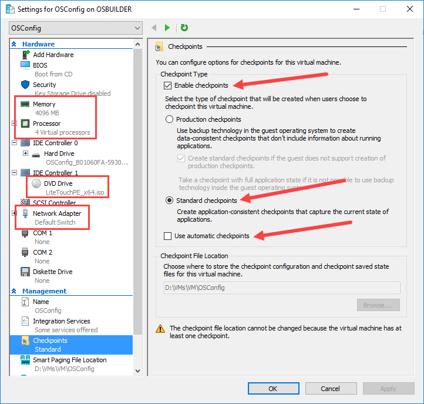

# Hyper-V VM Configuration

This should be easy enough.  Make sure you give your VM plenty of RAM \(not Dynamic if you can\) and enough Processor power.  The DVD Drive should be the LiteTouchPE\_x64.iso in your Deployment Share.

Standard Checkpoints should be enabled, and uncheck the **Use automatic checkpoints**

