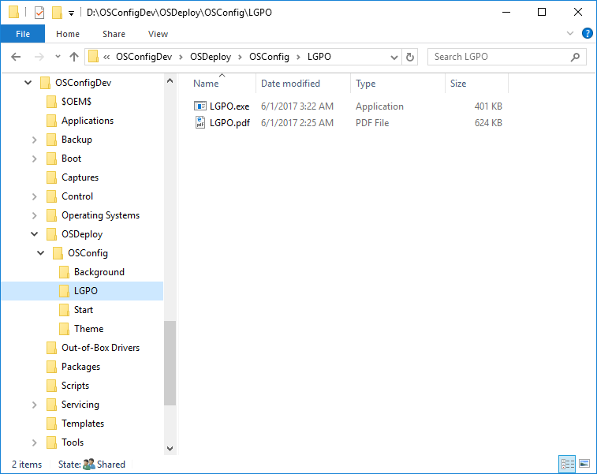

# LGPO

Now you need LGPO.exe.  Download LGOP.zip from the Microsoft Security Compliance Toolkit 1.0 download

{% embed data="{\"url\":\"https://www.microsoft.com/en-us/download/details.aspx?id=55319\",\"type\":\"link\",\"title\":\"Security Compliance Toolkit and Baselines\",\"description\":\"This set of tools allows enterprise security administrators to download, analyze, test, edit and store Microsoft-recommended security configuration baselines for Windows and other Microsoft products, while comparing them against other security configurations. \",\"icon\":{\"type\":\"icon\",\"url\":\"https://www.microsoft.com/favicon.ico?v2\",\"aspectRatio\":0},\"thumbnail\":{\"type\":\"thumbnail\",\"url\":\"https://c.s-microsoft.com/en-us/CMSImages/windows\_symbol\_clr\_56x56.png?version=3db565f2-d75c-d989-182d-07edaedef3c8\",\"width\":56,\"height\":56,\"aspectRatio\":1}}" %}

Extract the LGPO.zip contents to a subdirectory of OSConfig called LGPO

