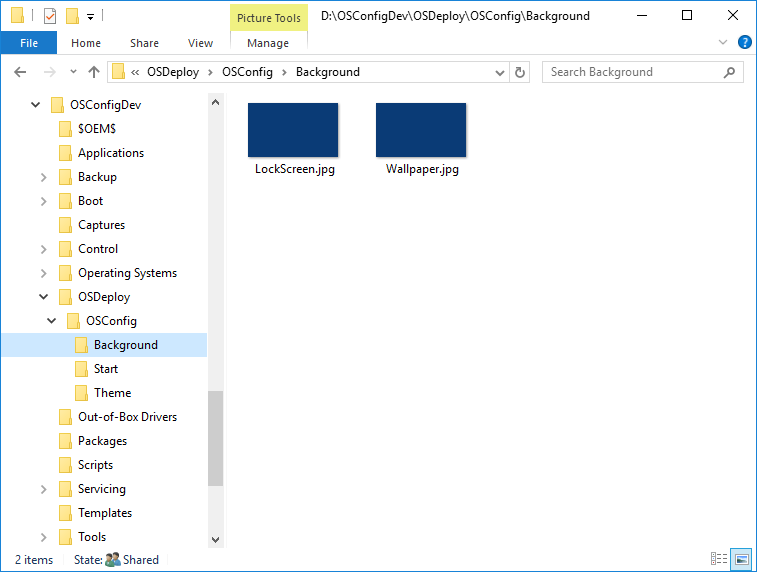

# LockScreen and Wallpaper

Get a LockScreen.jpg and a Wallpaper.jpg and place them in an OSConfig subdirectory called Background \(we will use these files a bit later\).  My files are 1980 x 1200px.  These files will be stretched, so it is recommended that you pick a solid color.


If you need sample files, get them from [GitHub](https://github.com/OSDeploy/OSConfig.Development/tree/master/Background)


