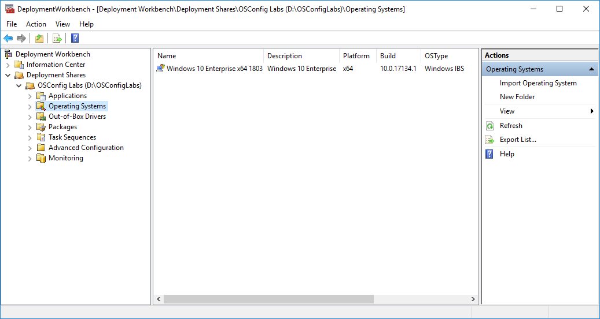

# MDT Deployment Share

The fastest way to setup and test OSConfig is by creating an MDT Dev Share on your computer and doing your development in Hyper-V.

## OSConfigLabs Deployment Share

Complete the MDT Wizard and create a new Deployment Share called OSConfigLabs

## Import an Operating System

In my case, I imported Windows 10 Enterprise x64 1803

## Create x64 Boot Image

No need to create an x86 Boot Image. Once you uncheck x86, Update the Deployment Share to create the Boot Image ISO. There is no need to change any other configuration.

