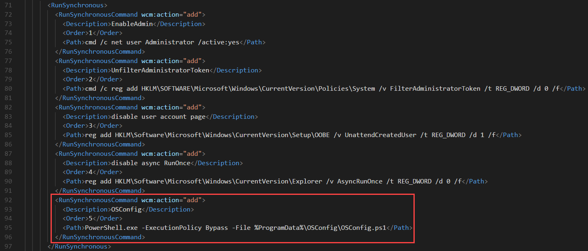

# MDT Development Share

The fastest way to setup and test OSConfig is by creating an MDT Dev Share on your computer and doing your development in Hyper-V.

### OSConfigLabs Deployment Share

Complete the MDT Wizard and create a new Deployment Share called OSConfigLabs


### Import an Operating System

In my case, I imported Windows 10 Enterprise x64 1803


### Create x64 Boot Image

No need to create an x86 Boot Image.  Once you uncheck x86, Update the Deployment Share to create the Boot Image ISO.  There is no need to change any other configuration.


### Create a New Client Task Sequence

Take the defaults, don't set an Administrator Password


### Edit the Task Sequence

In the Postinstall Phase, add a **Run Command Line** step right before Restart computer.  Name it Notepad and add the following in the **Command line**

```text
cmd /c notepad.exe
```


Add another **Run Command Line** step right after the Notepad step called **Copy OSConfig** with the following **Command line**

```text
cmd /c robocopy "%DeployRoot%\OSDeploy\OSConfig" %OSDisk%\ProgramData\OSConfig *.* /mir /ndl /nfl /r:1 /w:1 /xj /z
```


In the Options tab, add a 1 to the **Success codes** and check **Continue on error**


Add another Run Command Line as the first step in the State Restore phase


Apply and OK the Task Sequence to save the changes

### Edit Share and NTFS Permissions

Make sure you have Full Control in your Share Permissions


And NTFS Full control as well.  You will be copying files back and forth, so this will save some time


### Edit the Task Sequence Unattend.xml

Add a new RunSynchronousCommand entry to your Unattend.xml file at &lt;DeploymentShare&gt;\Control\&lt;TaskSequenceID&gt;\Unattend.xml

```text
<RunSynchronousCommand wcm:action="add">
  <Description>OSConfig</Description>
  <Order>5</Order>
  <Path>PowerShell.exe -ExecutionPolicy Bypass -File %ProgramData%\OSConfig\OSConfig.ps1</Path>
</RunSynchronousCommand>
```

When complete, it should look like this:



Save and close it.

### Add OSConfig.ps1

Download OSConfig.ps1 file at the following link

[https://raw.githubusercontent.com/OSDeploy/OSConfig.Labs/master/MDT%20Dev%20Share/OSConfig.ps1](https://raw.githubusercontent.com/OSDeploy/OSConfig.Labs/master/MDT%20Dev%20Share/OSConfig.ps1)

Save the file to the following path

```text
<DeploymentShare>\OSDeploy\OSConfig\OSConfig.ps1
```


### Complete

That's it.  Now its time to test . . .
