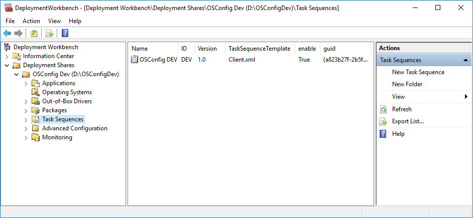
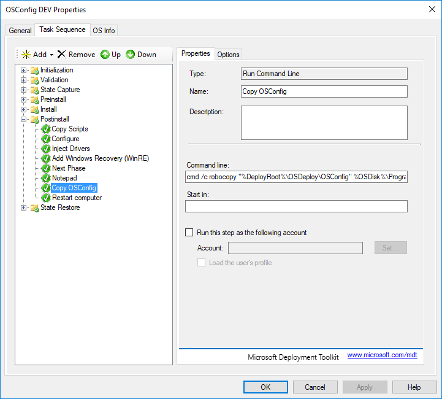
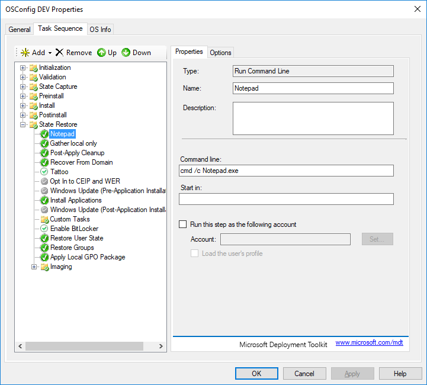

# MDT Task Sequence

Now create a new MDT Task Sequence \(take the defaults\). Leave the Administrator password blank



## Edit the Task Sequence

In the Postinstall Phase, add a **Run Command Line** step right before Restart computer. Name it Notepad and add the following in the **Command line**

```text
cmd /c notepad.exe
```


Add another **Run Command Line** step right after the Notepad step called **Copy OSConfig** with the following **Command line**

```text
cmd /c robocopy "%DeployRoot%\OSDeploy\OSConfig" %OSDisk%\ProgramData\OSConfig *.* /mir /ndl /nfl /r:1 /w:1 /xj /z
```



In the Options tab, add a 1 to the **Success codes** and check **Continue on error**


Add another Run Command Line as the first step in the State Restore phase



Apply and OK the Task Sequence to save the changes


ts.xml can be downloaded from [GitHub](https://github.com/OSDeploy/OSConfig.Development/tree/master/MDT%20Task%20Sequence)


## Edit the Task Sequence Unattend.xml

Add a new RunSynchronousCommand entry to your Unattend.xml file at &lt;DeploymentShare&gt;\Control\&lt;TaskSequenceID&gt;\Unattend.xml

```text
<RunSynchronousCommand wcm:action="add">
  <Description>OSConfig</Description>
  <Order>5</Order>
  <Path>PowerShell.exe -ExecutionPolicy Bypass -File %ProgramData%\OSConfig\OSConfig.ps1</Path>
</RunSynchronousCommand>
```

When complete, it should look like this:


Save and close it.


Unattend.xml can be downloaded from [GitHub](https://github.com/OSDeploy/OSConfig.Development/tree/master/MDT%20Task%20Sequence)


## Add OSConfig.ps1

Create the OSConfig.ps1 file with the following content

```text
#======================================================================================
#	Author: David Segura
#	Version: 18.8.7
#	https://www.osdeploy.com/osconfig/development/mdt-task-sequence
#======================================================================================
#	Start OSConfig
Write-Host "Starting OSConfig..." -ForegroundColor Yellow
Write-Host ""
#======================================================================================
#	OSConfig Content
#   Do Stuff Here!!!!!!
#======================================================================================
#	For Testing Only
Start-Process PowerShell_ISE.exe -Wait
Read-Host -Prompt "Press Enter to Continue"
#======================================================================================
```

Save the file to the following path

```text
<DeploymentShare>\OSDeploy\OSConfig\OSConfig.ps1
```



OSConfig.ps1 can be downloaded from [GitHub](https://github.com/OSDeploy/OSConfig.Development/tree/master/MDT%20Task%20Sequence)


## Complete

That's it. Now its time to get this working in a Virtual Machine

