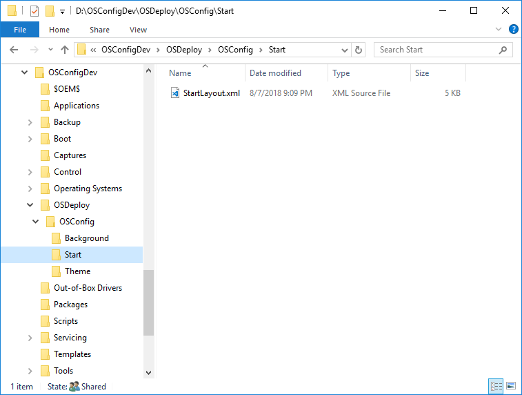

# Start Layout

You should already have a customized StartLayout.xml.  Place this file in a subdirectory of OSConfig in your Deployment Share \(we will use this file a bit later\)


You can get a sample StartLayout.xml from [GitHub](https://github.com/OSDeploy/OSConfig.Development/tree/master/Start)


