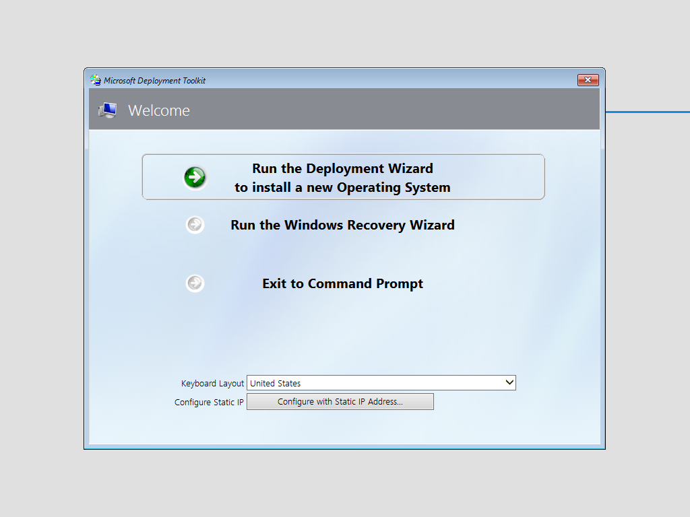
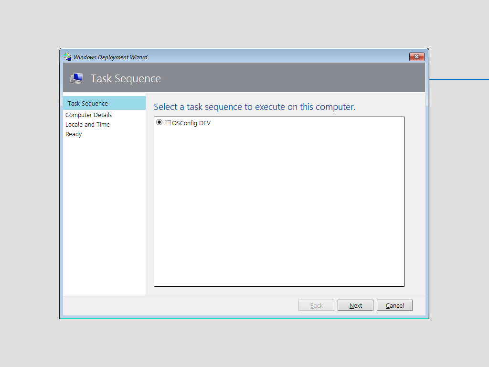
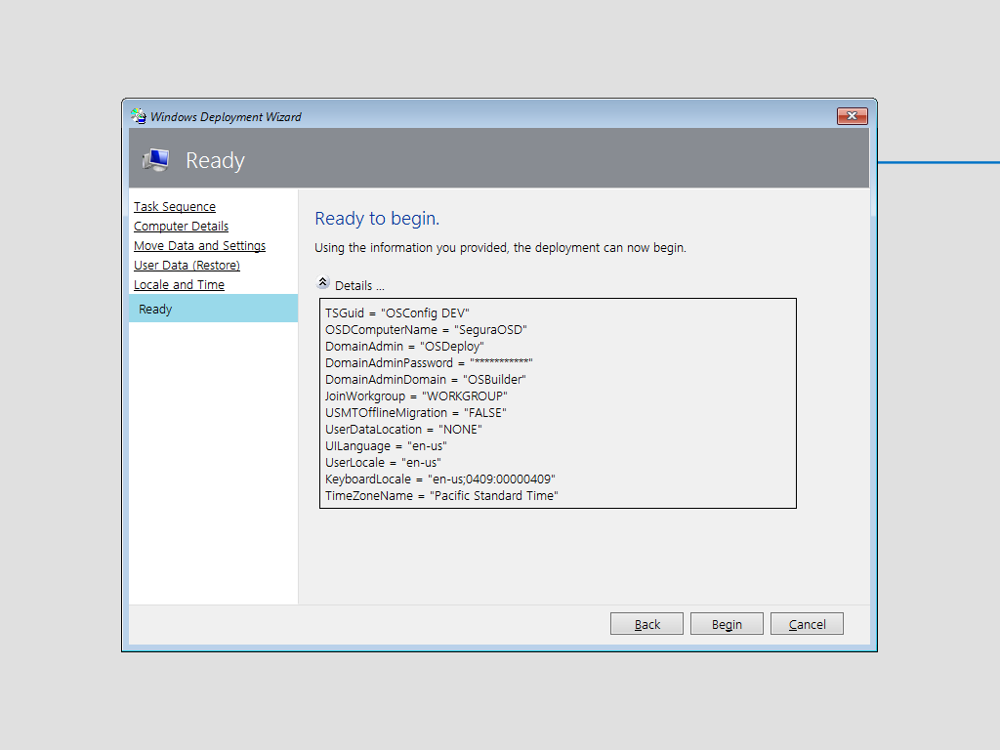
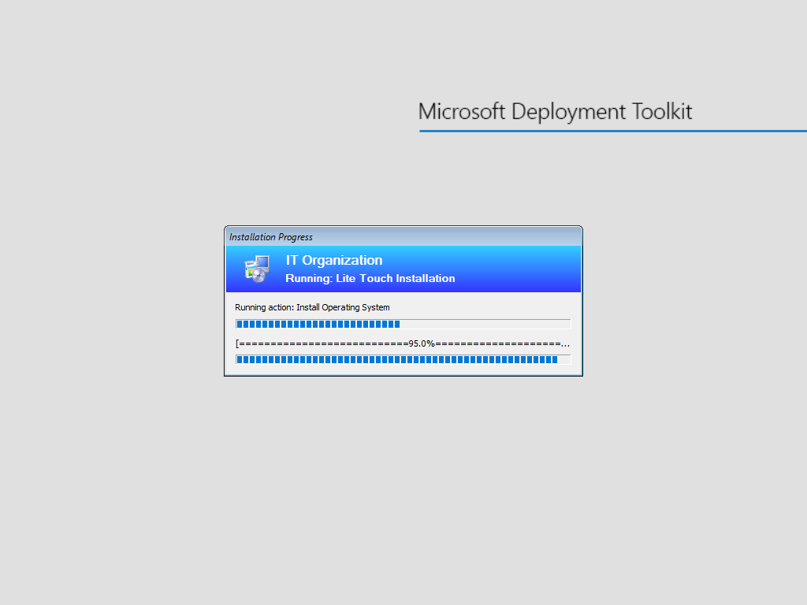
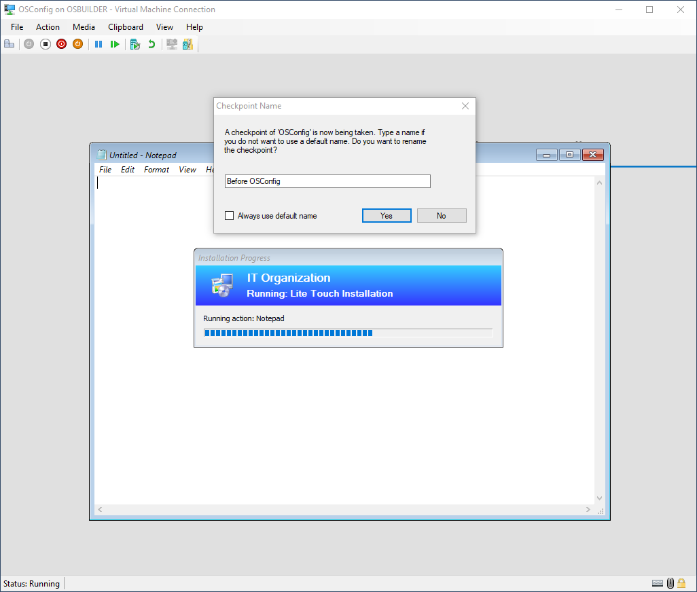
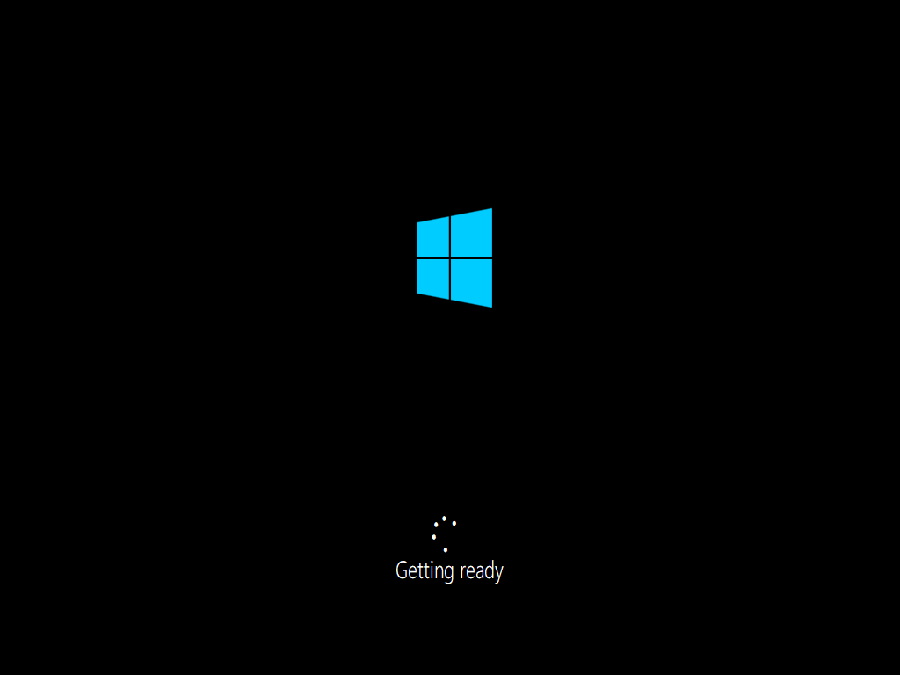
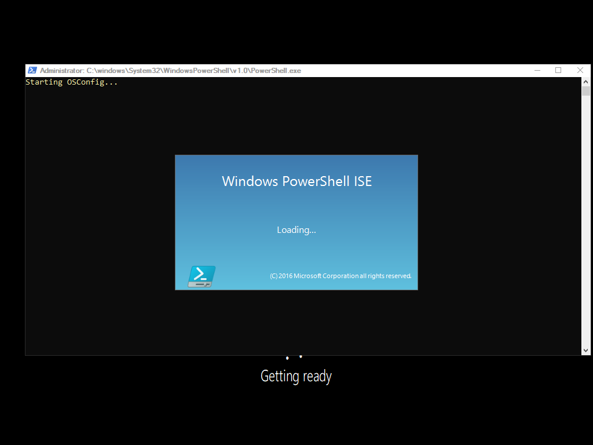
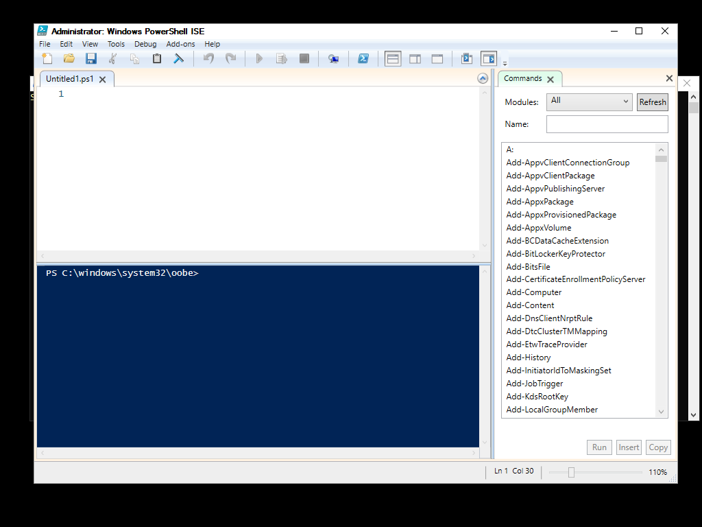

# MDT Task Sequence Test

Fire up your Hyper-V VM and let it boot to WinPE. Run the Deployment Wizard

Select the Task Sequence

Give it a unique name

Begin

And let the OS install

## Checkpoint

Create a Checkpoint when Notepad opens. Close Notepad and the VM should reboot

The VM will restart

## OSConfig Sucess!

If everything worked right, PowerShell ISE should open

And here is full PowerShell ISE running in the Specialize phase . . . notice the path?

Close PowerShell ISE and then press Enter to continue the Deployment process. If you do not see the PowerShell Window, press Alt+Tab

And here is the second Notepad step that was added to the Task Sequence. The purpose of adding this is to keep the Deployment Process running. This allows you to save content from the VM to the Deployment Share \(which is why we allow Full Control\)

## What's the Point?

You now have a hook in your Task Sequence to apply changes to your OS before first login. You also have VM Snapshot and method to test your customizations repeatedly with minimal effort . . .

Over the next few days, I'll detail how to make customizations to the Logon Screen, Start Layout, Theme, and Local Policies, without using any Reg Hacks. If you are used to adding multiple steps in your Task Sequences to make these changes, those are no longer necessary. If you can script the step in PowerShell, then you can add it to your OSConfig.ps1.

