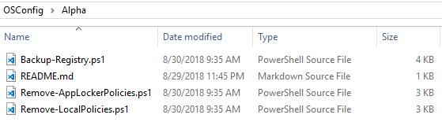
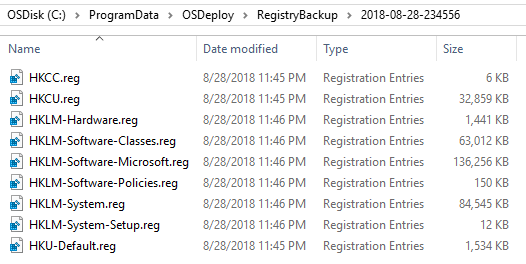

# Alpha

Since OSConfig process subdirectories Alphabetically, the Alpha directory was created to run these scripts first

## Backup-Registry.ps1

This PowerShell script will export the registry into reg files.  These files are saved in %ProgramData%\OSDeploy\RegistryBackup\%DateTime%

While these files are not necessary, they do provide a snapshot of the system before OSConfig does its damage.  Additionally you can use this script to create a snapshot anytime, or even use it as a Before/After to see what changes are made when configuring a setting

## Remove-AppLockerPolicies.ps1

Deletes %SystemRoot%\System32\AppLocker.  This prevents any AppLocker configuration from disturbing OS Upgrades.  These should be reapplied from a Domain GPO without issue

## Remove-LocalPolicies.ps1

Deletes %SystemRoot%\System32\GroupPolicy.  This clears out Local Policies that may impact OS Upgrades

