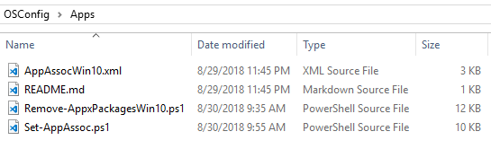

# Apps

Files and scripts related to Applications or Appx Packages should be placed in this directory

## AppAssocWin10.xml

Sample Application Association file for Windows 10.  This contains entries to use PhotoViewer instead of the Photos App for viewing Images.  PhotoViewer is not enabled by default in Windows 10 and requires adding registry keys to enable


[Export or Import Default Application Associations](https://docs.microsoft.com/en-us/windows-hardware/manufacture/desktop/export-or-import-default-application-associations)


## Remove-AppxPackagesWin10.ps1

Sample script to remove Appx Packages from Windows 10.  Additionally, this script will export a list of installed Appx Packages to C:\ProgramData\OSDeploy\Apps\\*

## Set-AppAssoc.ps1

Uses DISM to import the Default App Associations file

