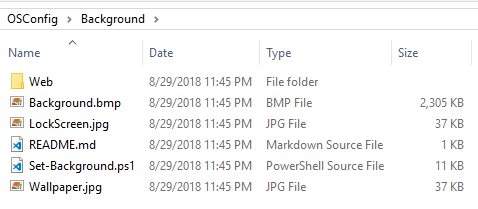

# Background

If you don't want the default Hero wallpaper and the random Logon Background, then you need to customize the Background.

## Web

This directory contains the 4k Wallpaper that is part of Windows 10.  Windows does not honor a custom background set in Group Policy and a Custom Theme during Feature Updates \(Upgrades\).  Unfortunately the only way to resolve this is to overwrite the Wallpaper that exists in this directory.  Replace the contents of the Web directory with your custom Wallpaper.  For my Enterprise, we use a solid blue color.  Selecting a solid color prevents issues with stretching images.

## Background.bmp

Used for Windows 7

## LockScreen.jpg

Custom Lock Screen image if you are going to set one.  Requires Local Policy to be set to use the custom Lock Screen background.

## Set-Background.ps1

Script to make the modifications to the Background for the Lock Screen and the Wallpaper.

## Wallpaper.jpg

Custom Windows Wallpaper.  Requires Local Policy to be set and modifications to the Theme file

