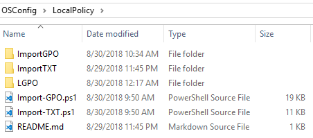

# LocalPolicy

LocalPolicy is the bridge to bringing your Group Policy Objects into Local Policy.  Currently Group Policy and Registry Group Policy Preferences are applied using OSConfig and the Import-GPO.ps1


LGPO.exe is required for LocalPolicy to apply.  This is not included in the OSConfig download


## ImportGPO

GPO Backups or GPO copies from Sysvol placed in this directory will be applied to Local Policy using Import-GPO.ps1

## ImportTXT

LGPO Text files placed in this directory will be processed by LGPO.exe using Import-TXT.ps1

## LGPO

Directory containing LGPO.exe as detailed on this link



## Import-GPO.ps1

Script to process GPO files contained in the ImportGPO directory

## Import-TXT.ps1

Script to process LGPO Text files contained in the ImportTXT directory

