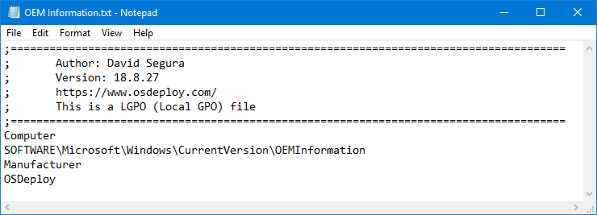

# ImportTXT

LGPO supports the import registry import using TXT files.  I won't go into too much detail on this, you can learn how to use this by reading LGPO.pdf included with the LGPO download.

TXT files placed in this directory will be imported by Import-TXT.ps1

