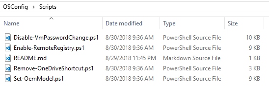
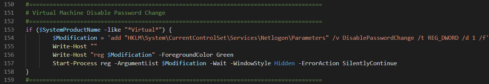
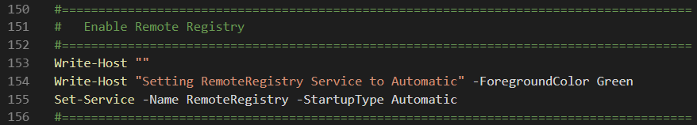
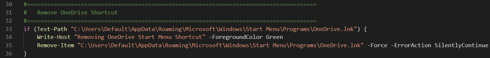
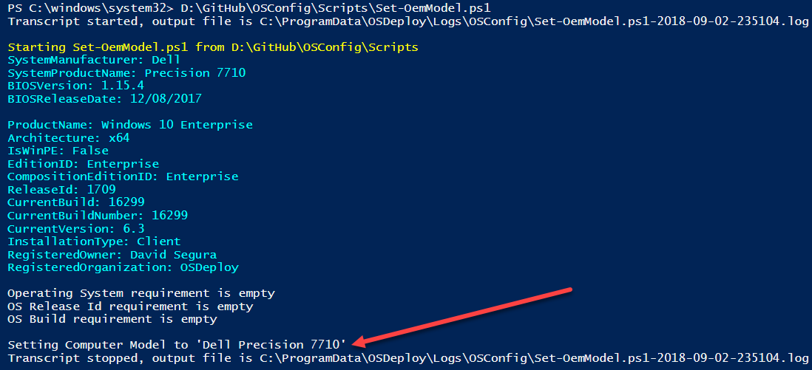
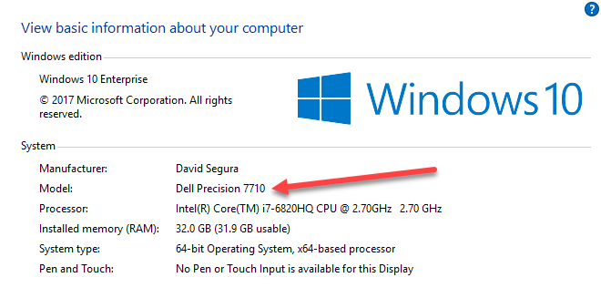

# Scripts

Scripts are where you should put general PowerShell scripts to configure your deployments.  Samples have been provided.

## Disable-VmPasswordChange.ps1

Script sets a registry value if the Computer Model is like 'Virtual'.  The Machine Password change is what prevents reverting back to old snapshots on Domain joined computers

## Enable-RemoteRegistry.ps1

Script enables the Remote Registry service

## Remove-OneDriveShortcut.ps1

This script will remove the OneDrive shortcut from the Start Menu

## Set-OemModel.ps1

The purpose of this script is to set the OEM information with the Computer Manufacturer and Model.

