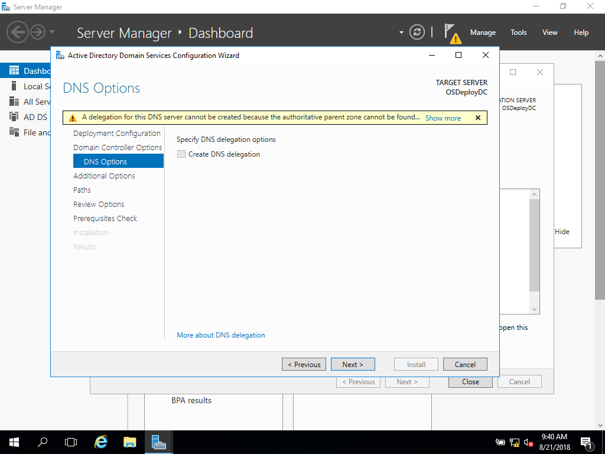

# Build a Domain Controller

If you do not have rights to create a GPO in Active Directory, or you do not use Active Directory, you can easily build one in a Virtual Machine.

Create a new Virtual Machine without External Network Access \(you don't want to see your Production Network\).  You can add a Network Adapter with 'Internal' to access your PC if necessary


[Download a Windows Server 2016 Evaluation Copy](https://www.microsoft.com/en-us/evalcenter/try)


### Install Windows Server 2016 Standard \(Desktop Experience\)

Take the Defaults

### Rename Your Server

Choose a friendly name

### Add Roles and Features

Add Active Directory Domain Services

Group Policy Management Feature should automatically be selected

Promote the server to a domain controller

Add a new forest and specify a Root domain name \(make one up\)

Set the DSRM password

Press Next on the next few screens

Press Install

A Restart will be required to complete the installation

