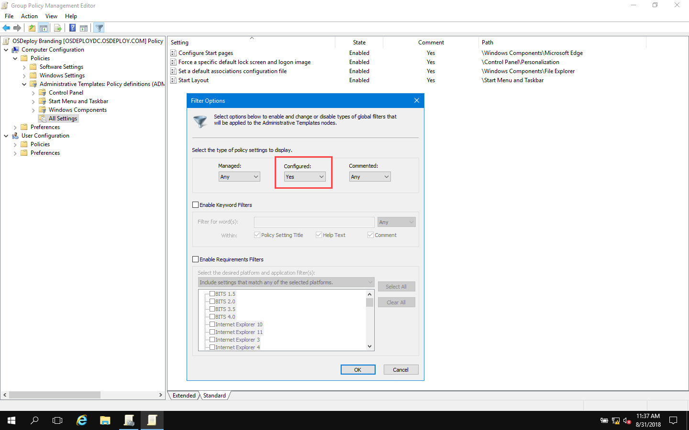
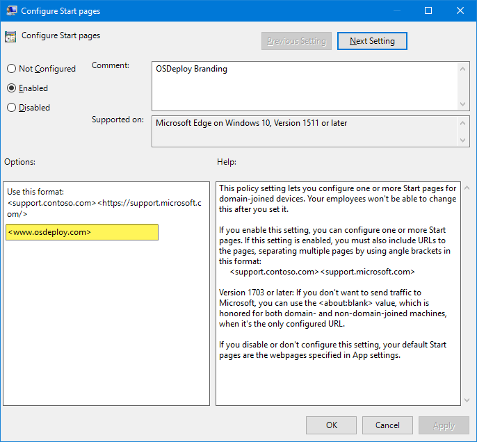
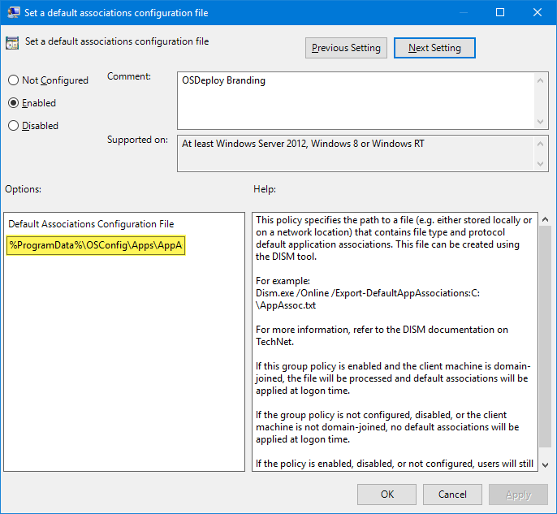
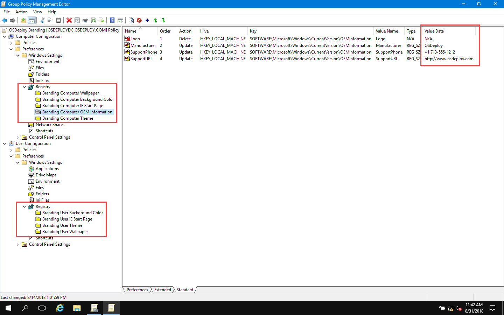

# Edit OSDeploy Branding GPO

Now that you have imported your OSDeploy GPOs, you can edit them.  OSDeploy Branding should contain all your unique settings for your Enterprise.

## Filter Policies for Easy Viewing

The easiest way to see configured Policies is with a Filter set to Configured Policies



## Configure Start Pages

Set your proper Edge Start Page



## Logon Image, Default Associations, Start Layout, and Theme \(User\)

The remainder of the Policies are as needed.  Disable the Policies you do not intend to use



## Edit Registry Preferences

Edit the existing registry entries for your Enterprise for both Computer and User Configuration



## Complete

Once you have made these changes, simply Backup or Copy this GPO and place it in OSConfig at the following path

```text
OSConfig\LocalPolicy\ImportGPO\OSDeploy Branding
```


