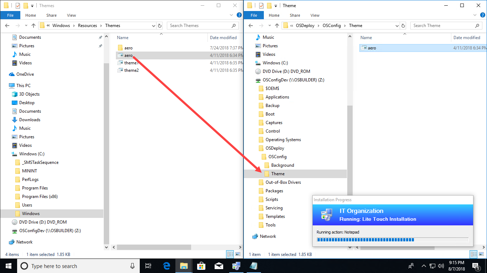
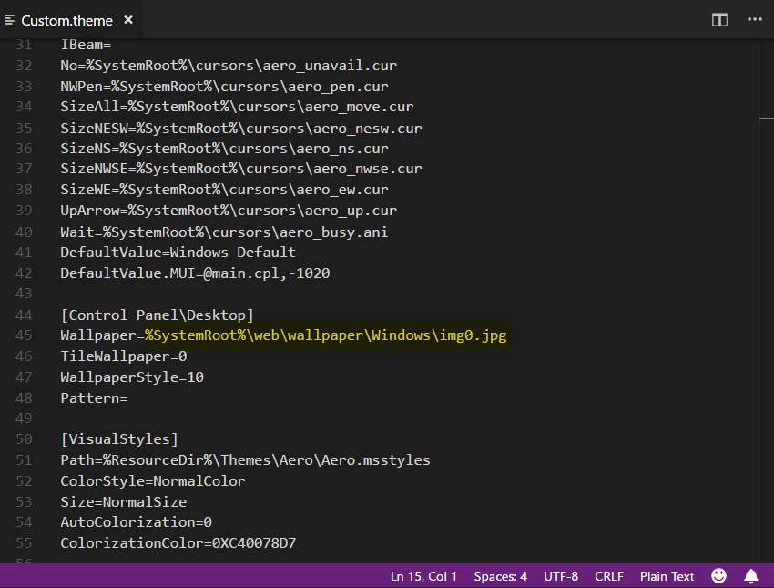

# Theme Customization

Get a copy of your aero.theme file from C:\Windows\Resources\Themes and copy to a subdirectory of OSConfig called Theme



Rename the file to Custom.theme

Edit the file and change the Wallpaper from the default value to the following line and save it

```text
Wallpaper=%ProgramData%\OSConfig\Background\Wallpaper.jpg
```




