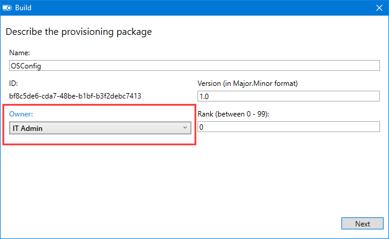

# OSConfig to PPKG

This is the Cheddar.  If you have OSConfig customized to your liking . . . you can proceed to the Finish Line  and create a Provisioning Package.


You need to get OSConfig.ps1 version 18.9.4 or newer to support Provisioning Packages properly.  [OSConfig Release Information](https://www.osdeploy.com/osconfig/downloads/osconfig)


You can following this process or use the Microsoft Guide linked below


[Use a script to install a desktop app in provisioning packages](https://docs.microsoft.com/en-us/windows/configuration/provisioning-packages/provisioning-script-to-install-app)


## OSDeploy PowerShell Module

Before going any further, make sure you have the OSDeploy PowerShell Module installed, unless you want to create a CAB DDF file manually.



## Convert OSConfig to CAB

Use New-CAB \(OSDeploy PowerShell Module\) to create a CAB from a Directory using the following command

```text
New-CAB -SourceDirectory D:\DeploymentShare\OSDeploy\OSConfig
```


When complete, you will have a DDF \(Directive File\) and CAB


## Create a New Advanced Provisioning Package

Using WICD, create an Advanced Provisioning Package and enter some random details


All Windows desktop editions should work fine


## Create a Provisioning Command <a id="create-a-provisioningcommand"></a>

In the left Navigation Pane, expand ProvisioningCommands and PrimaryContext.  In the Name field, enter OSConfig and press the Add button


## Set the Command File <a id="set-the-command"></a>

Select the Command on the Left Navigation Pane. In the Main window, Browse to OSConfig.ps1.  Enter the following CommandLine

```text
PowerShell.exe -ExecutionPolicy Bypass -File OSConfig.ps1
```

Set the other values as shown


## Add a Dependency Package

Now its time to add a Dependency Package.  In the Left Navigation Pane, select DependencyPackages.  In the Main window, Browse to the OSConfig.cab and press the Add button.


## Export the Provisioning Package <a id="export-the-provisioning-package"></a>

Select Export from the top Menu and then select Provisioning package


## Build Owner <a id="build-owner"></a>

Change the Build Owner to IT Admin



## Build Security <a id="build-security"></a>

Leave this blank for general Provisioning


## Save Path <a id="save-path"></a>

Set the proper location to save the Provisioning Package


## Build <a id="build"></a>

Build the Provisioning Package


## Complete

Now you have a complete OSConfig as a Provisioning Package.  You can now use this in your OS Deployments


See this link for guides on adding the Provisioning Package in the Task Sequence




