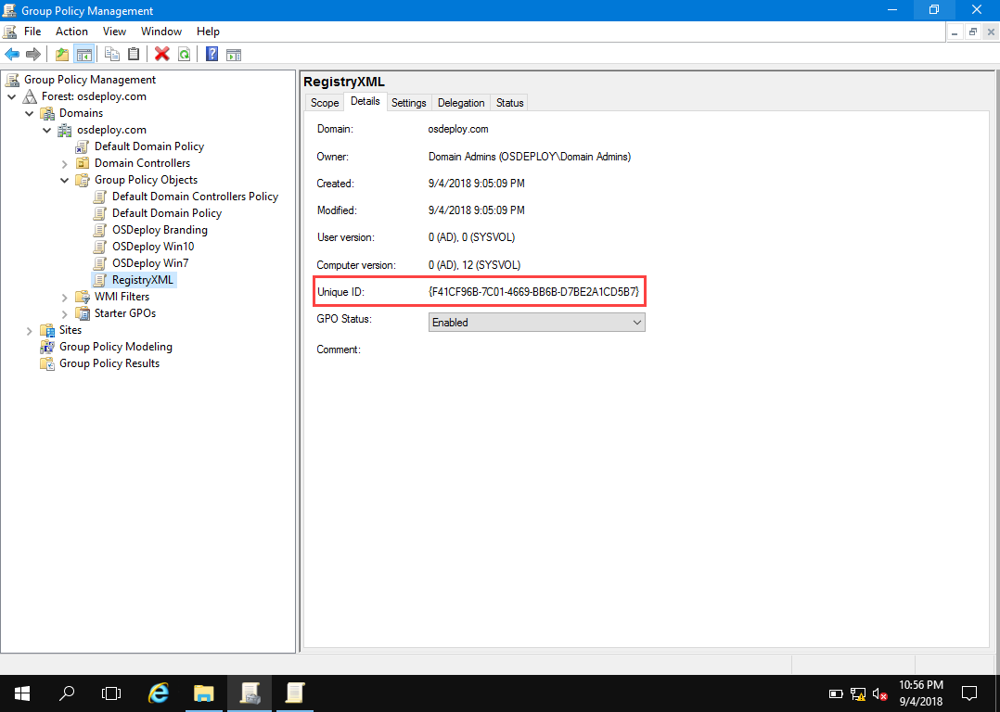
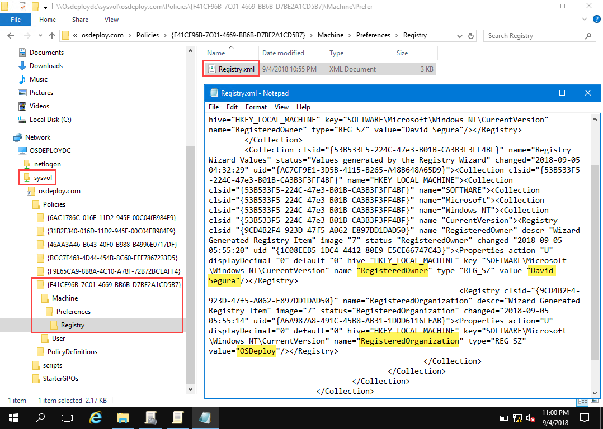
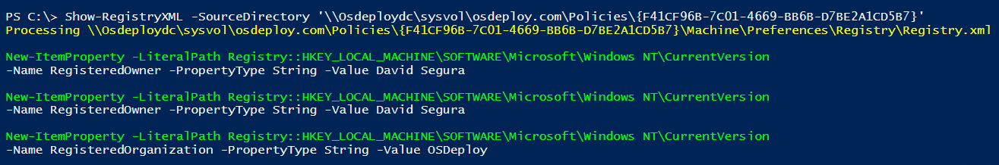

# GPP Registry.xml

Let's take a look at Group Policy Preferences Registry.xml . . .

## GPO Unique ID

Every GPO has a Unique ID \(GUID\).  This can be found in the GPO Details

## Sysvol

In the Domain Sysvol, the Unique ID is in the Policies.  If you have set a GPP Registry item, all the Registry entries are saved in a file called Registry.xml.

## Read GPP Registry.xml

If you have installed the OSDeploy PowerShell Module . . . 



You can easily read the GPP Registry.xml file in PowerShell

## Apply GPP Registry.xml

OSConfig automatically applies Group Policy Preferences Registry.xml when the GPO is added into the LocalPolicy Customization



