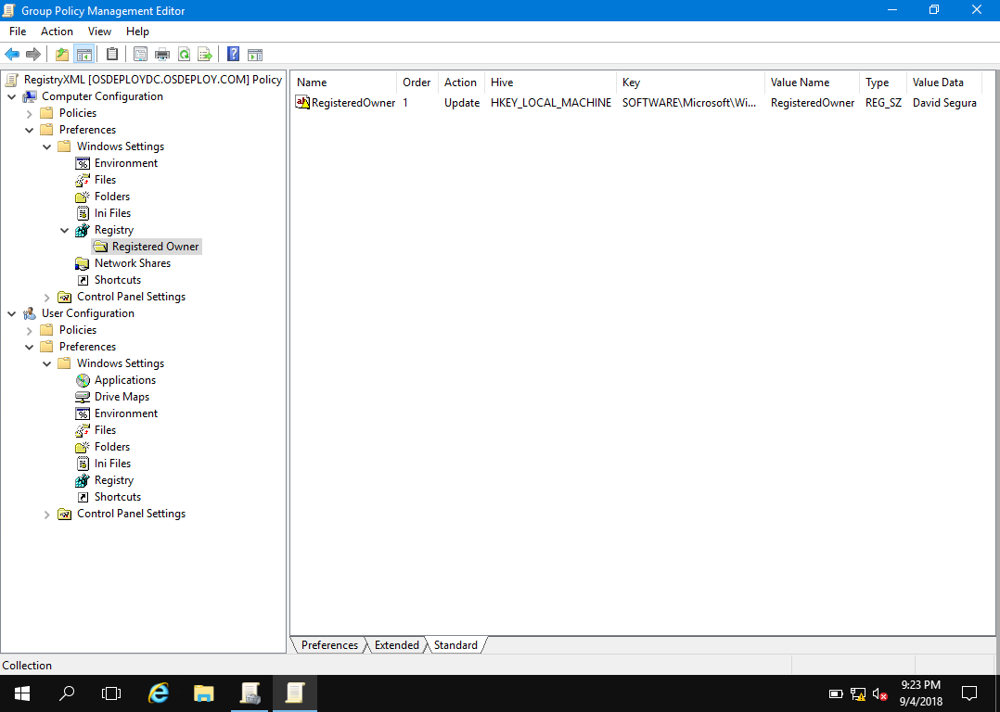

# Group Policy Preferences

Let's start with a Group Policy Object.  Both Computer Configuration and User Configuration contain a Registry section under Preferences\Windows Settings.  The purpose of these sections is to add Registry values and apply them through the GPO.

## Adding a Registry Value

You can add a Registry Value by using 'Registry Item'.  Think of 'Collection Item' as a folder.  'Registry Wizard' allows you to browse and copy values from the system Registry.

## Create a Collection Item

Start by creating a **Computer Configuration Collection Item** called **Registered Owner** by right clicking on Registry and selecting **New &gt; Collection Item**.  As you can see a **Collection Item** can also be described as a Folder.  This is useful in organizing entries.

## Create a Registry Item

In the **Registered Owner Collection Item**, right click on **Registered Owner** and select **New &gt; Registry Item**.  In Key Path, browse to **HKEY\_LOCAL\_MACHINE\SOFTWARE\Microsoft\Windows NT\CurrentVersion** and select **RegisteredOwner**.  Press the **Select** button.

  Now you can set the Value data to whatever you want and press OK to save it

And now you have created your first Registry Preference

## Using Registry Wizard

Instead of selecting New &gt; Registry Item, try **New &gt; Registry Wizard** instead.  This will bring up a **Registry Browser** and allow you to select multiple Registry Items.  Press **Finish**.

Now you have nested **Collection Items** \(Folders\) with the Registry Values that were checked.  You can edit these as needed.  One thing about using the Registry Wizard is that I absolutely hate working with it.  For one thing I have noticed, not everything checked seems to transfer over . . . the second thing is that you cannot maximize the Registry Browser window.  This is absolutely annoying!

## Next Steps

Now it's time to learn about Group Policy Registry.xml on the next page . . .

