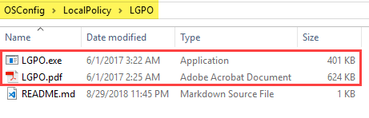

# LGPO

LGPO is required for full OSConfig functionality.  It is part of the Microsoft Security Compliance Toolkit and can be downloaded from the following link.



## Download Instructions

From the link above, when selecting Download, you have to option to select individual components.  Select the LGPO.zip

## OSConfig Integration

Extract the zip and place LGPO.exe and LGPO.pdf into the OSConfig\LocalPolicy\LGPO directory

