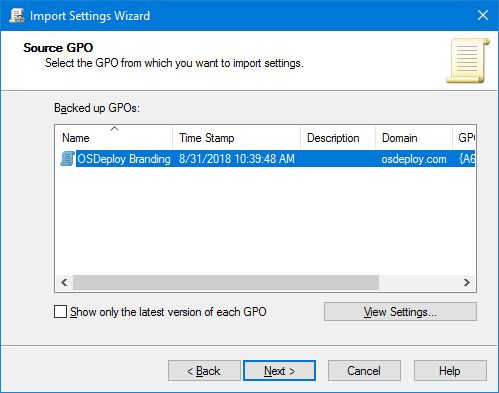

# Import OSDeploy GPOs

The OSConfig repository you downloaded includes some sample Group Policy Objects.  These are GPO Backups \(not copies from Sysvol\).

## Create and Import OSDeploy GPOs

In Group Policy Management, create a new GPO.  In my example I have created **OSDeploy Branding**.  Right click on the OSDeploy Branding GPO and select **Import Settings**

Select the OSDeploy Branding GPO from the OSConfig Repository and import it

## Complete

Repeat this process for OSDeploy Win10 and OSDeploy Win7 and you should be ready to start editing the GPOs

