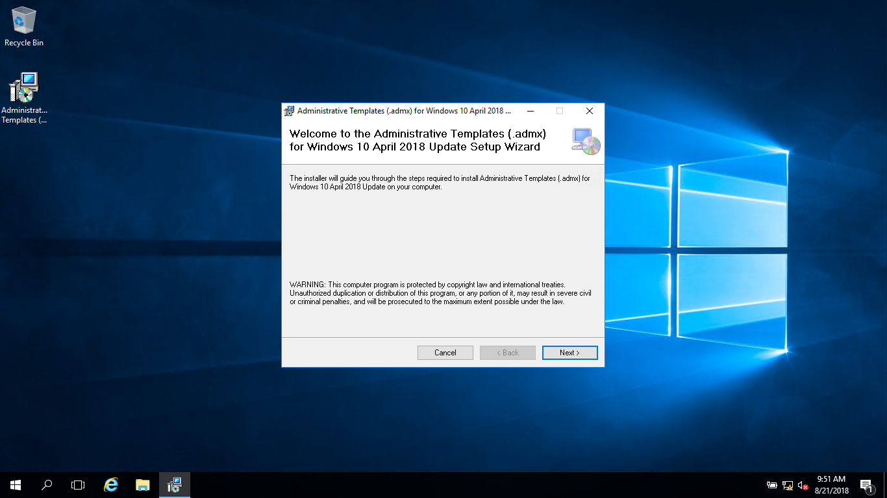
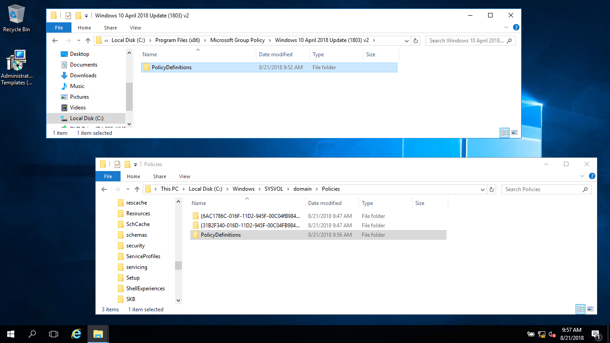
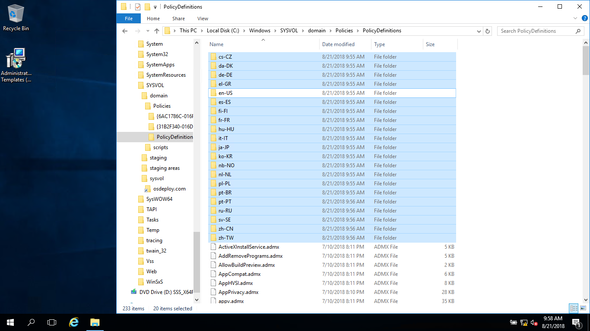
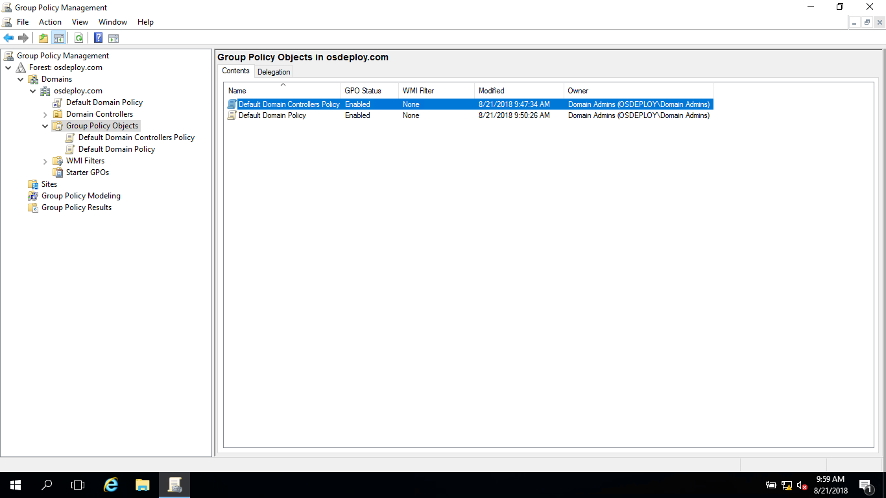

# Update ADMX Templates

The goal of this section is to setup a GPO with Policies and Preferences \(Registry\) for Windows Deployments.  If you do not manage Active Directory, then don't worry about this step.  Get your AD Team to get the latest ADMX Templates published.

### Install ADMX Templates

Make sure that before you start, you have updated your ADMX Templates from this link


[Microsoft ADMX Templates Download and How To Setup](https://support.microsoft.com/en-us/help/3087759)


### Copy Policy Definitions

Copy the PolicyDefinitions from C:\Program Files \(x86\)\Microsoft Group Policy\\* to your SYSVOL \(C:\Windows\SYSVOL\domain\Policies\)

Remove Languages that you don't need

### Open Group Policy Management

Everything looks good!

