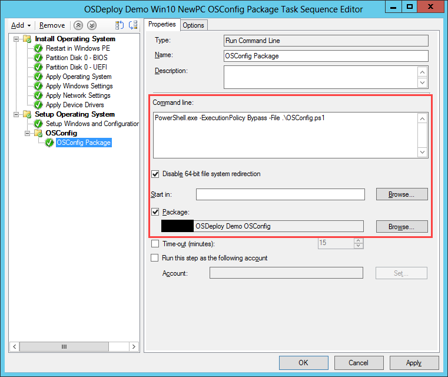

# ConfigMgr TS NewPC Package

The easiest method of applying OSConfig to a New PC is directly from a Package and a Run Command Line.  This method is not recommended for testing as the OSConfig progress is not displayed.

The following steps are required

* OSConfig must be created as a Package \(no Program\)

### Create an OSConfig Package

Create a new Package with Source Files to the root of your OSConfig content.  Do not create a Program.  Distribute Content to your Distribution Points

### Task Sequence Run Command Line

Add a Run Command Line step after the "Setup Windows and Configuration Manager" step.  Use the following Command Line:

```text
PowerShell.exe -ExecutionPolicy Bypass -File .\OSConfig.ps1
```

Make sure that you disable 64-bit file system redirection and that you run from your OSConfig package.



### Complete

If everything worked fine, your Operating System should show your customizations prior to first logon


