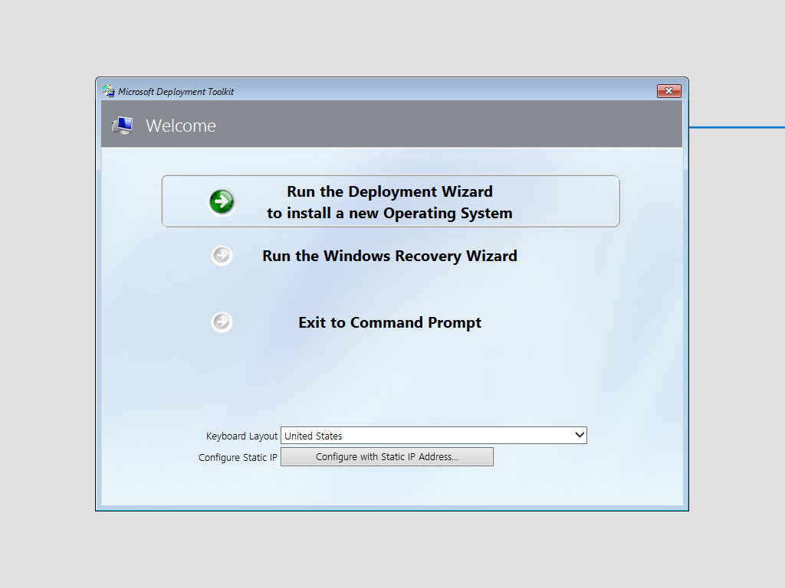
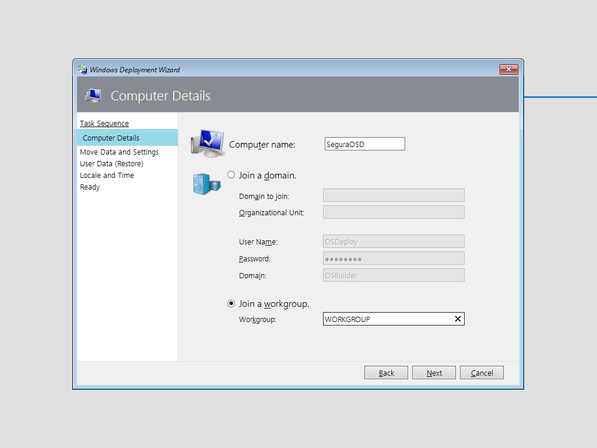
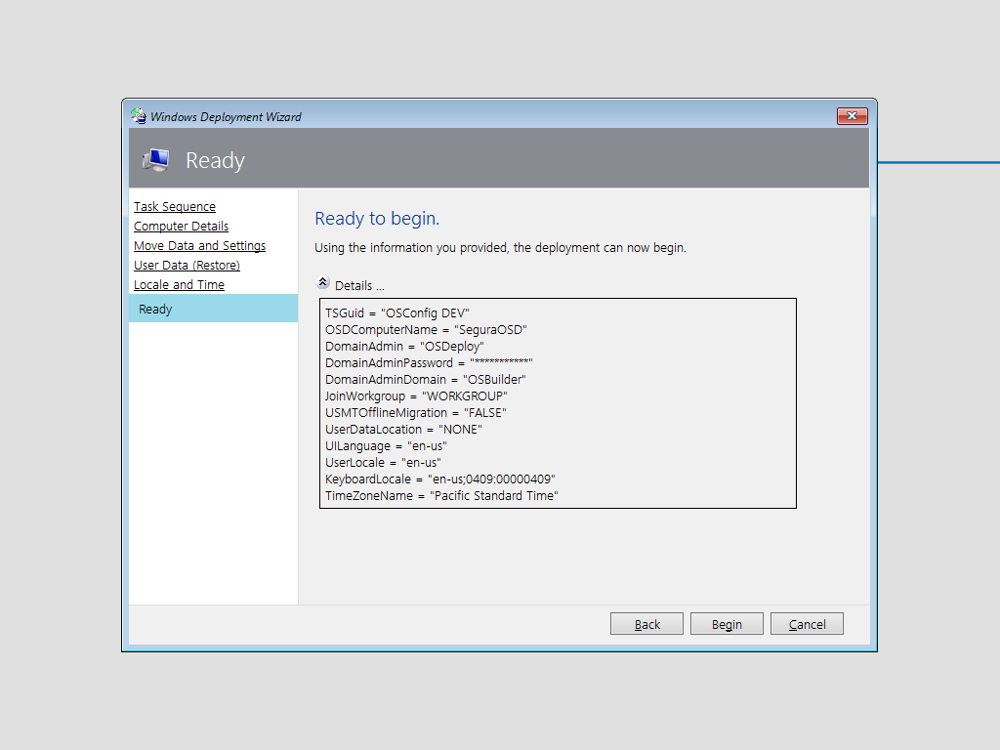
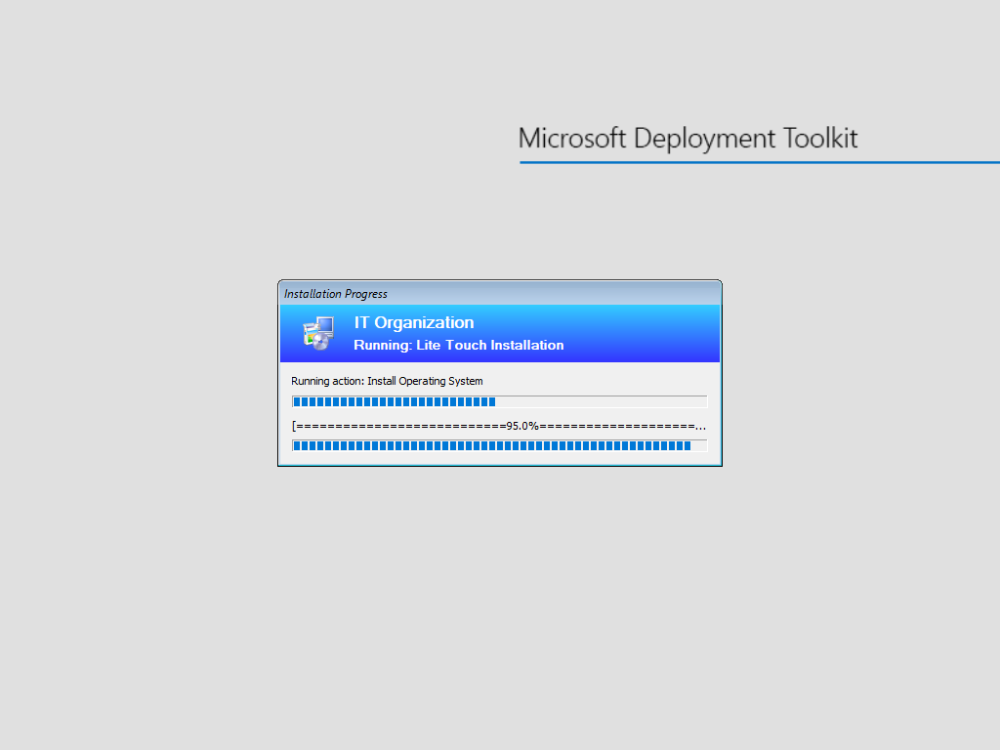
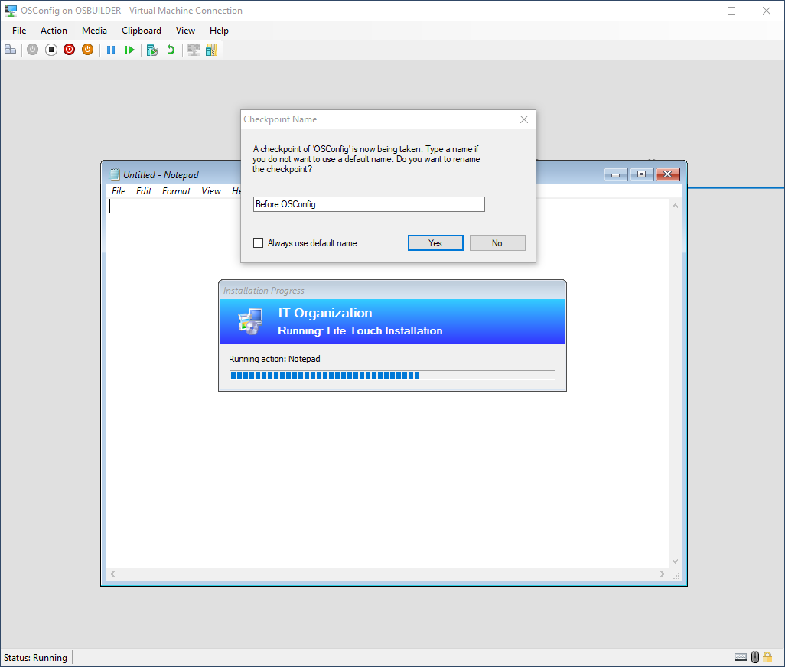
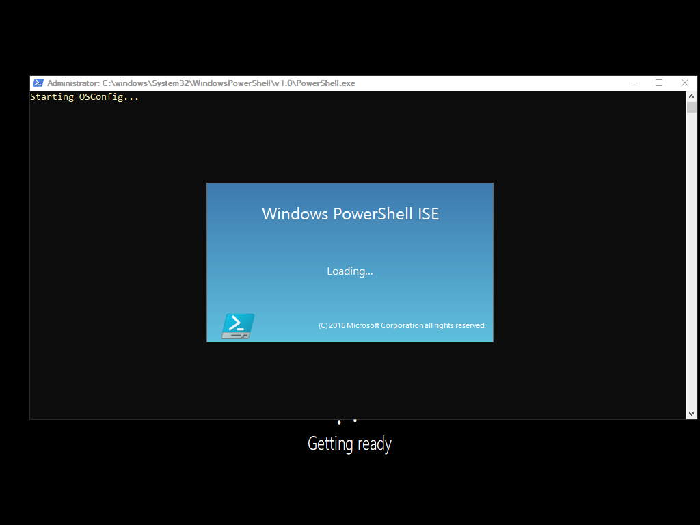
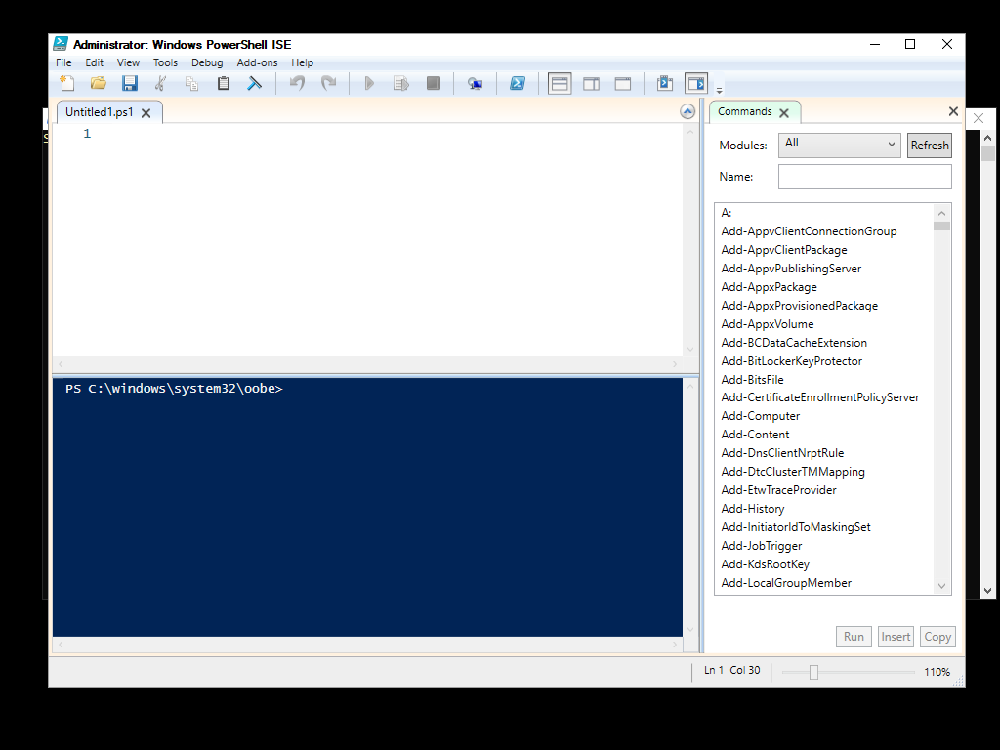

# First Test

Fire up your Hyper-V VM and let it boot to WinPE.  Run the Deployment Wizard

Select the Task Sequence

Give it a unique name

Begin

And let the OS install

### Checkpoint

Create a Checkpoint when Notepad opens.  Close Notepad and the VM should reboot

The VM will restart

### OSConfig Sucess!

If everything worked right, PowerShell ISE should open

And here is full PowerShell ISE running in the Specialize phase . . . notice the path?

### What's the Point?

This is the point of OSConfig.  Apply ALL your OS Customizations using PowerShell, before Explorer Shell even loads.

