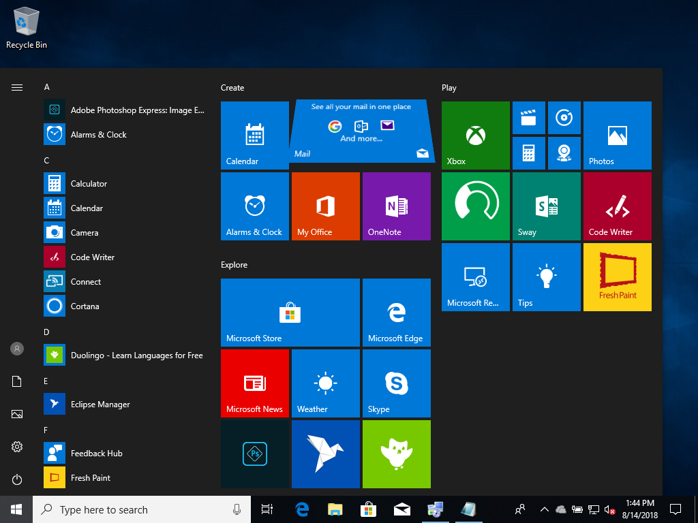
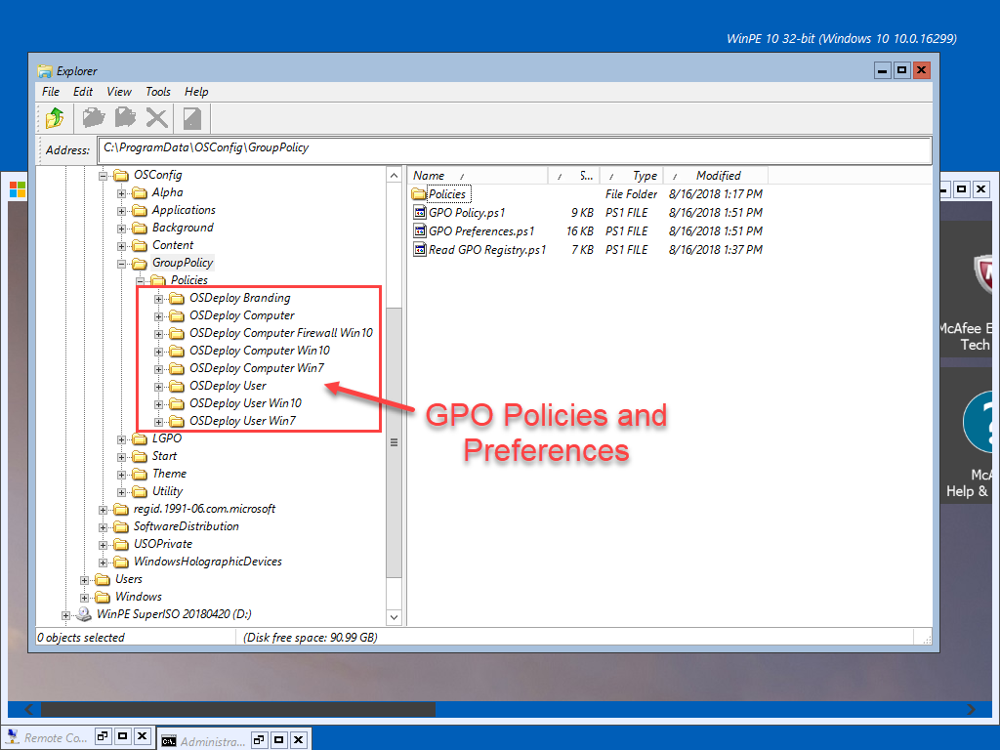
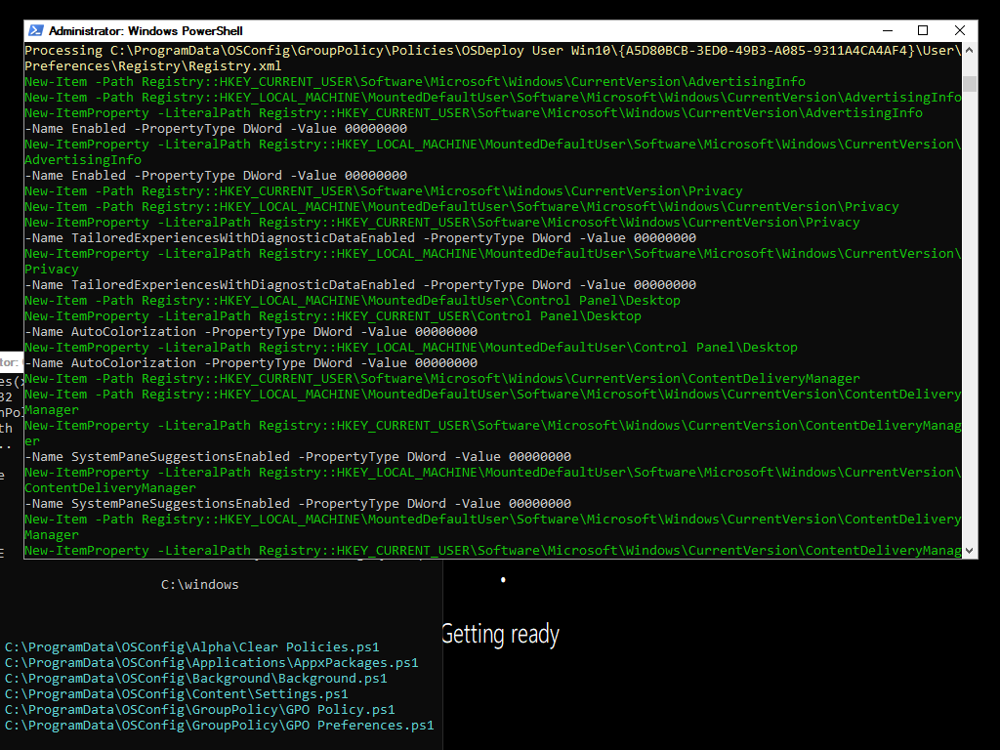
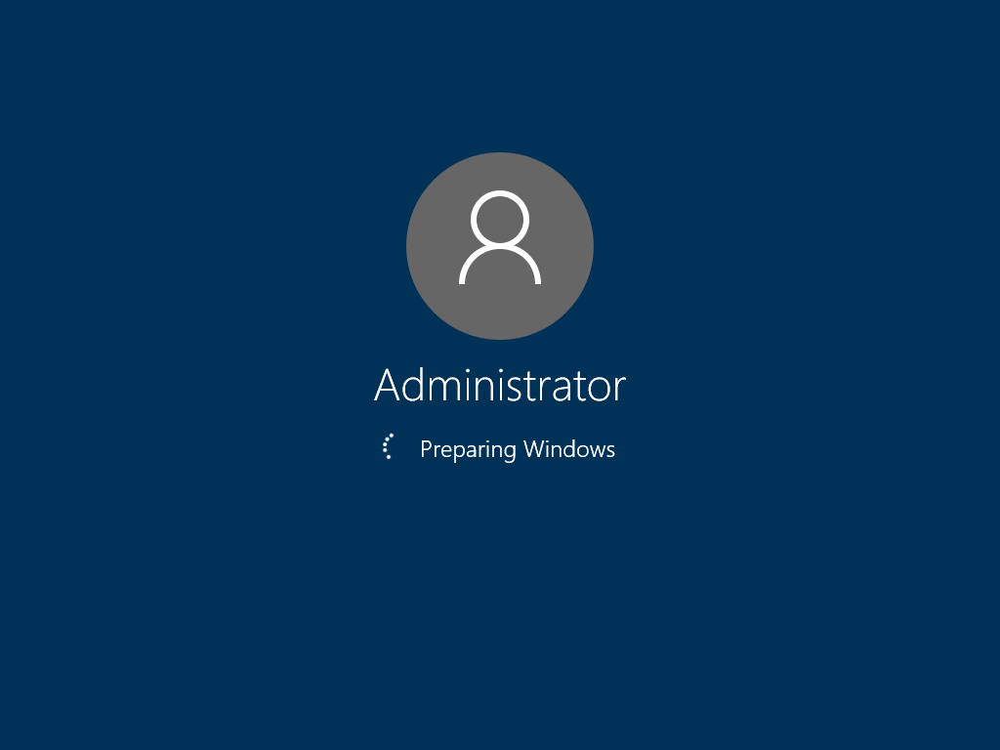
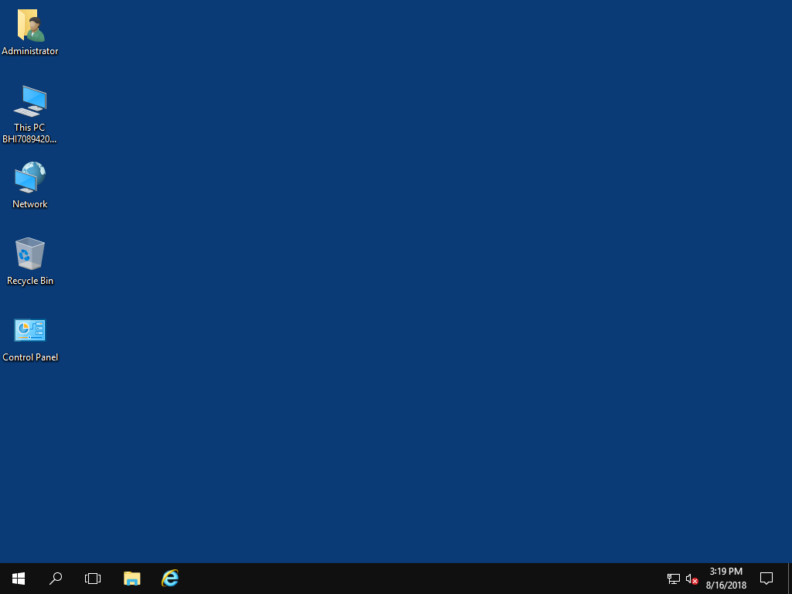
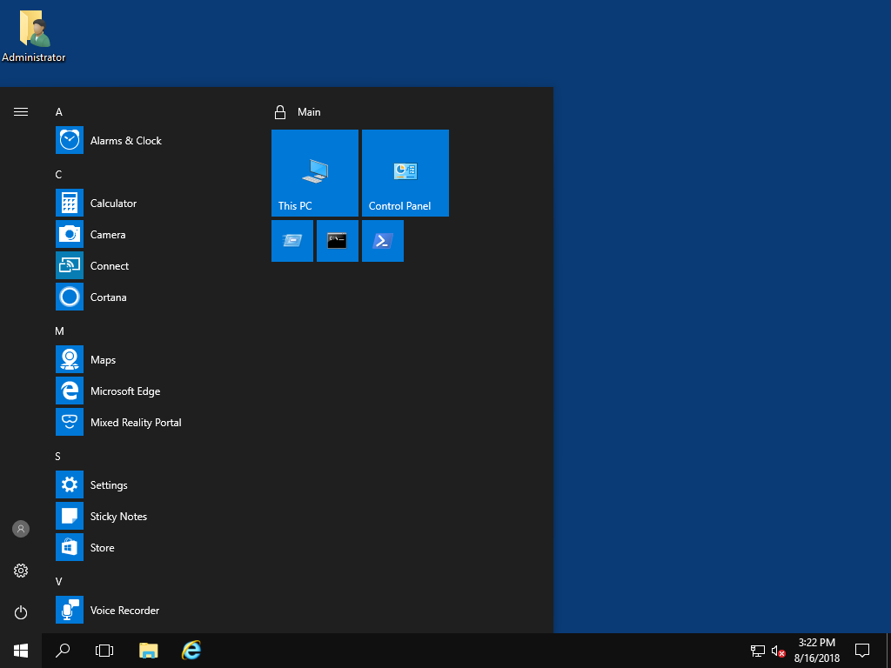

# OSConfig Overview

OSConfig is a **method** of applying Operating System configuration during a Windows Deployment as a Package, without having multiple steps in your Task Sequence. This allows for **simple** configuration that is **independent** of a Task Sequence.

## Modular 

Because the goal of OSConfig is to remove all Customizations from the Task Sequences, and to place all of them in OSConfig, this allows the customizations to be Modular.  The benefit of this is that you can use this in whatever Deployment method you can think of.  Additionally, this allows the customizations to be integrated in a Provisioning Package :\)

## OSConfig Deployment Scenarios

OSConfig has been testing in the following Operating System Deployment Scenarios

* Standalone \(autounattend.xml\)
* MDT Client Task Sequence
* MDT Upgrade Task Sequence
* ConfigMgr New PC Task Sequence
* ConfigMgr Upgrade Task Sequence
* Provisioning Packages

The flexibility of OSConfig makes this method of Operating System configuration **ideal**, as it is completely modular. This gives you the ability to freely to design whatever configuration you can script without any limitations.

## Supported Operating Systems

The OSConfig method has been tested on Windows 7 and Windows 10, and should work without issue on Windows Server deployments.

## Enterprise Customization

We all know what it looks like if you do nothing. This is simply not an ideal presentation for your Enterprise.  OSConfig uses Group Policy as the primary method of customizing the Operating System.

## Group Policy

It's actually much easier to take all your Policies and Preferences and put them in Group Policy instead of having multiple steps and custom scripts in your Task Sequence

## Local Copy

Once you have all your settings in Group Policy, simply copy the Policies from SysVol to your OS during deployment, or run in an SCCM Package.

## LGPO

Use Local GPO to apply these Policies

## Apply Preferences with PowerShell

Since LGPO only applies Policies and not Preferences, simply add a PowerShell script to read the GPO Preferences and apply the settings \(yes I will publish said script soon\)

## Customized OS

And as soon as Windows starts for the first time, everything is configured exactly how you want it. Fully customized without multiple steps in the Task Sequence. Screenshots below were taken on first boot from OOBE without joining a Domain. All customizations are done locally, without separate Reg Hacks.

