# PowerShell Script to PPKG

In this example, the PowerShell script Set-OemModel.ps1 will be converted to a Provisioning Package.  This script is part of OSConfig and found in the OSConfig\Scripts directory.  This script has a simple purpose of setting the OEM Model information in System Properties.


## Windows Imaging and Configuration Designer

If you don't have WICD installed, you can get it from the Windows 10 ADK.  Create a new Project

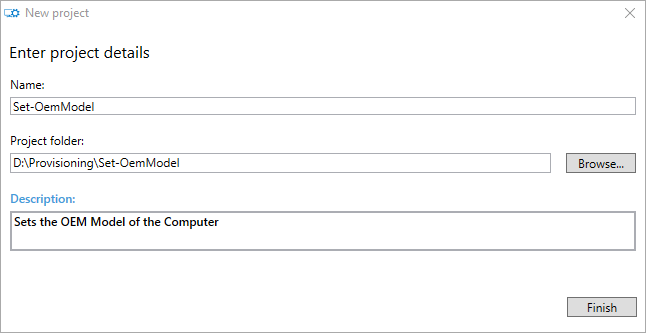

## Switch to Advanced Editor

Switch from the Basic to the Advanced Editor

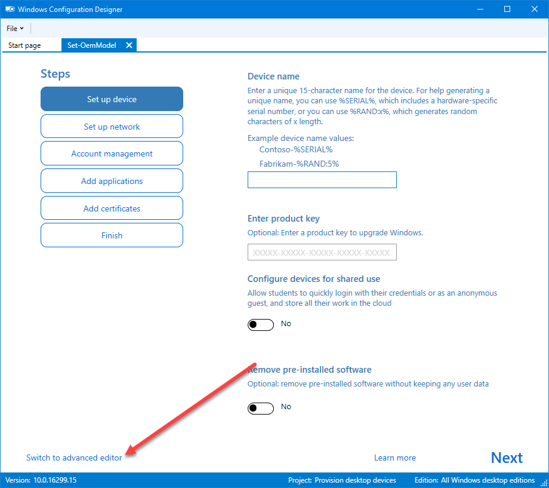

## Remove Runtime Settings

Select Runtime settings from the right Navigation Pane and select Remove

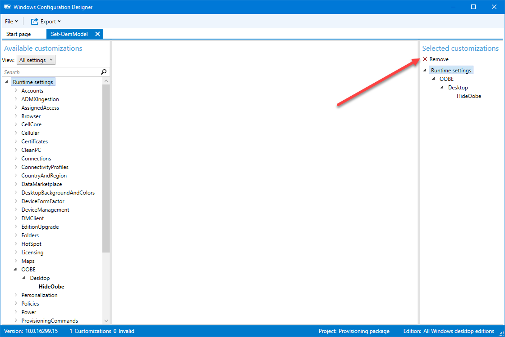

## Create a ProvisioningCommand

In the left Navigation Pane, expand ProvisioningCommands and PrimaryContext.  Add a Name and press the Add button

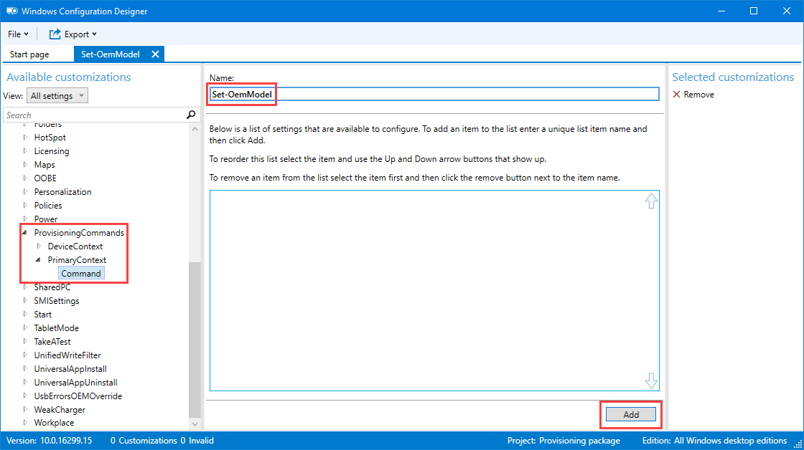

## Set the Command

Select the Command on the Left Navigation Pane.  In the Main window, Browse for the PowerShell file and enter the following CommandLine

```text
PowerShell.exe -ExecutionPolicy Bypass -File Set-OemModel.ps1
```

Set the other values

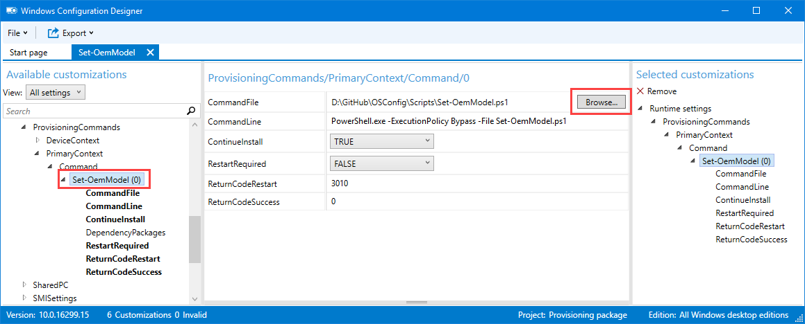

## Export the Provisioning Package

Select Export from the top Menu and then select Provisioning package

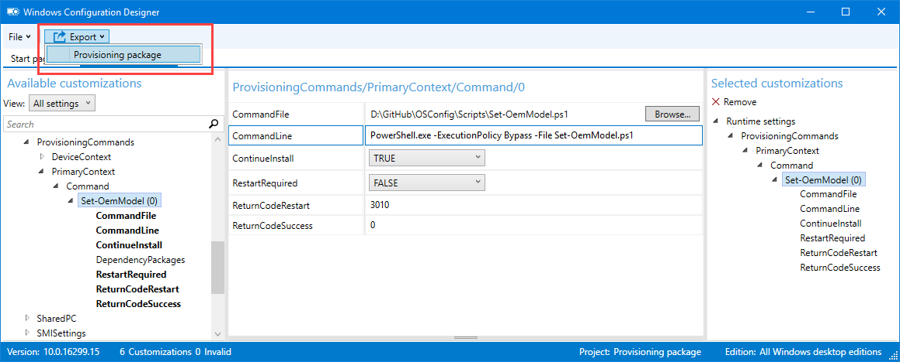

## Build Owner

Change the Build Owner to IT Admin

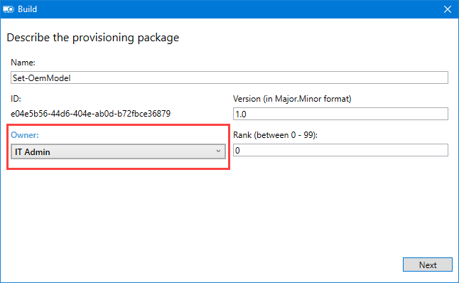

## Build Security

Leave this blank for general Provisioning


## Save Path

Set the proper location to save the Provisioning Package

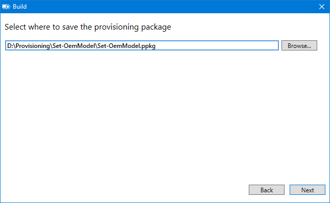

## Build

Build the Provisioning Package

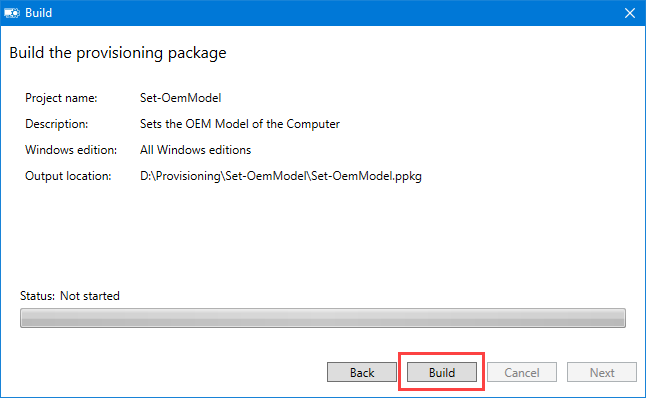

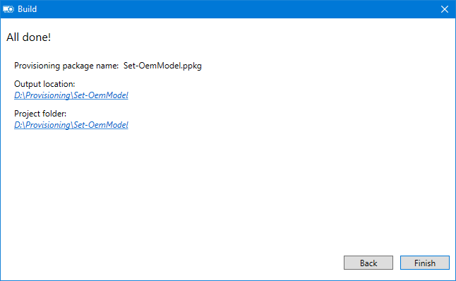

## Testing

You can easily test a Provisioning Package by simply double clicking on the file.  You will be prompted for confirmation

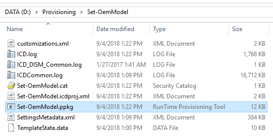

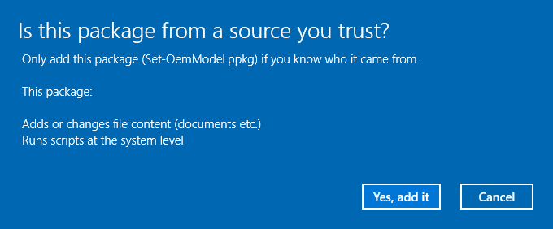

## Validation

Here is a before and after to show the results

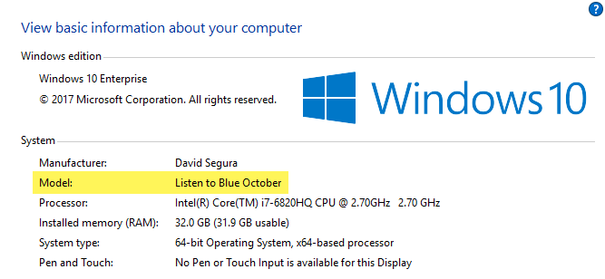

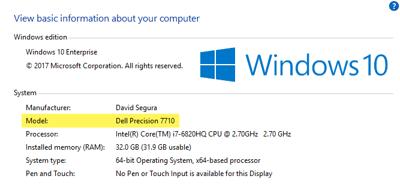

## Download

You can download the Provisioning Package created in this page by selecting the link below



## Further Information

Provisioning Packages are expanded to the Current User %Temp% directory

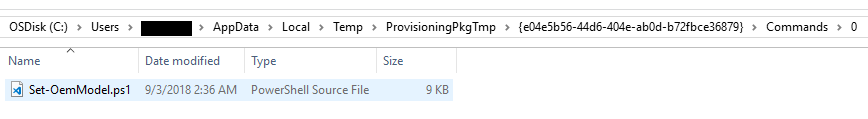

In the case of Provisioning Packages that are executed in OOBE, they are in the following location

```text
%SystemRoot%\System32\Config\SystemProfile\AppData\Local\Temp\ProvisioningPkgTmp\*
```


