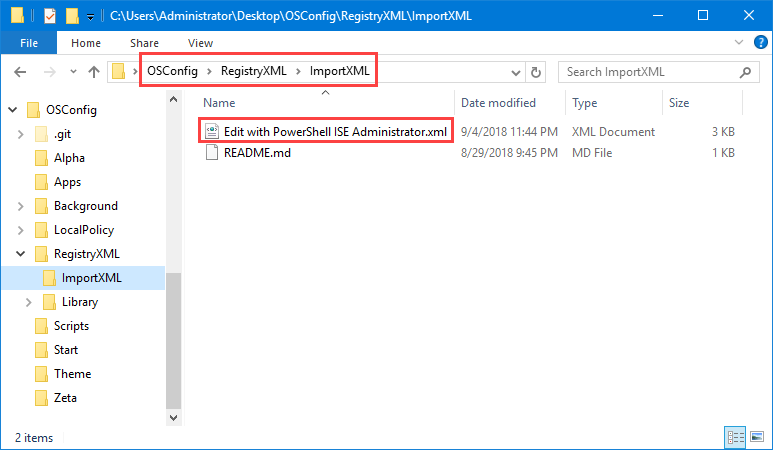

# Apply RegistryXML Files

While you can add your Registry settings in Group Policy Preferences, there is an easier way.  Simply place the RegistryXML file you created on the last page in your **OSConfig\RegistryXML\ImportXML** directory.  OSConfig will automatically apply any XML files in this directory to the Registry of the Deployment OS.

