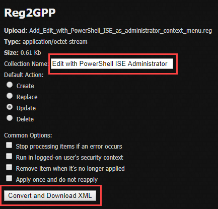
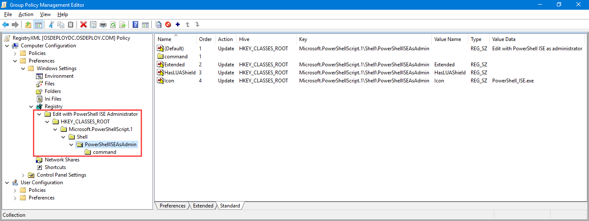
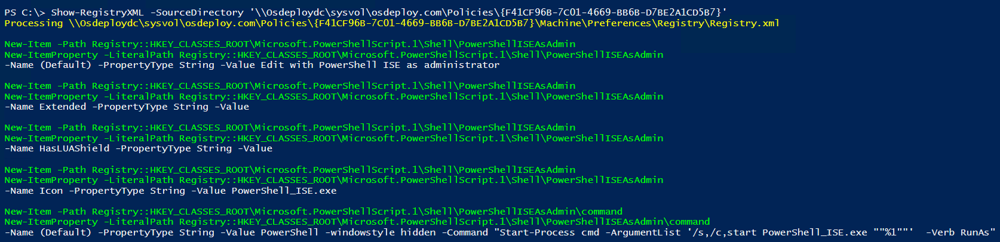

# Convert REG to RegistryXML

Here is where things get very easy . . . let's first find a REG file that we want to add to Group Policy.  A great place to find all kinds of REG files is to check at Ten Forums.  Here is one that will add an **Edit with PowerShell ISE as Administrator** in the Context Menu.  In the link below, download the REG file



## Reg 2 GPP

Now head over to this link and upload the REG file



Now modify the **Collection Name** and click the **Convert and Download XML** button

## Copy and Paste XML in GPP Registry

A simple right click and Copy on the XML file your downloaded, then Paste into Group Policy Management.  These Registry values will be added by OSConfig when adding the GPO to the LocalPolicy Customization

## Show-RegistryXML

And here are the values that show up when using Show-RegistryXML

