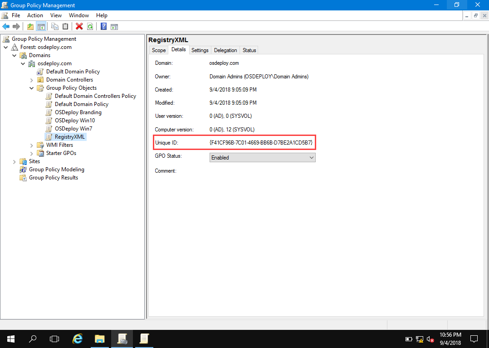
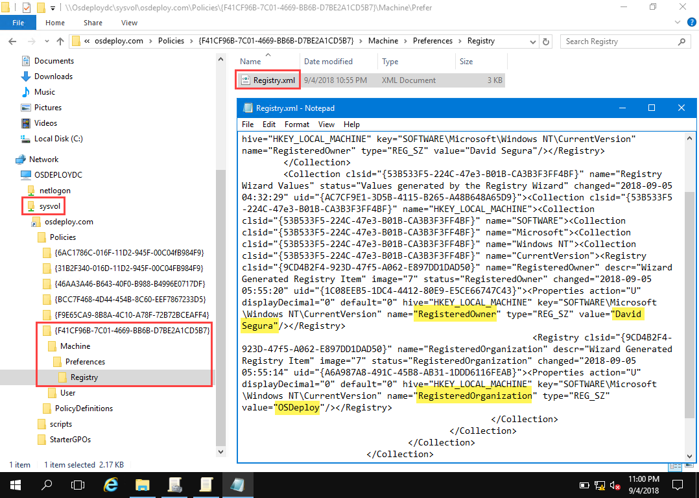
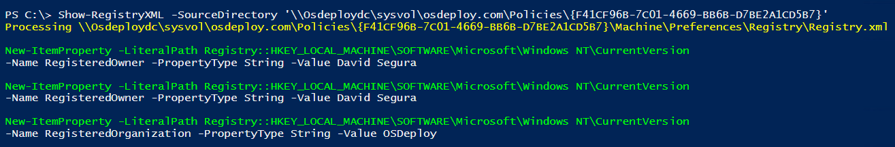

# GPP Registry.xml

Let's take a look at Group Policy Preferences Registry.xml . . .

## GPO Unique ID

Every GPO has a Unique ID \(GUID\).  This can be found in the GPO Details

## Sysvol

In the Domain Sysvol, the Unique ID is in the Policies.  If you have set a GPP Registry item, all the Registry entries are saved in a file called Registry.xml.

## Read GPP Registry.xml

If you have installed the OSDeploy PowerShell Module . . . 

{% embed data="{\"url\":\"https://www.osdeploy.com/osconfig/downloads/osdeploy-powershell-module\",\"type\":\"link\",\"title\":\"OSDeploy PowerShell Module - OSDeploy\",\"icon\":{\"type\":\"icon\",\"url\":\"https://blobscdn.gitbook.com/v0/b/gitbook-28427.appspot.com/o/spaces%2F-LDKRxGiKLYjW1gana2O%2Favatar.png?generation=1532585359921615&alt=media\",\"aspectRatio\":0},\"thumbnail\":{\"type\":\"thumbnail\",\"url\":\"https://www.gitbook.com/share/space/thumbnail/-LDKRxGiKLYjW1gana2O.png\",\"width\":1200,\"height\":630,\"aspectRatio\":0.525}}" %}

You can easily read the GPP Registry.xml file in PowerShell

## Apply GPP Registry.xml

OSConfig automatically applies Group Policy Preferences Registry.xml when the GPO is added into the LocalPolicy Customization

{% embed data="{\"url\":\"https://www.osdeploy.com/osconfig/customization/localpolicy\",\"type\":\"link\",\"title\":\"LocalPolicy - OSDeploy\",\"icon\":{\"type\":\"icon\",\"url\":\"https://blobscdn.gitbook.com/v0/b/gitbook-28427.appspot.com/o/spaces%2F-LDKRxGiKLYjW1gana2O%2Favatar.png?generation=1532585359921615&alt=media\",\"aspectRatio\":0},\"thumbnail\":{\"type\":\"thumbnail\",\"url\":\"https://www.gitbook.com/share/space/thumbnail/-LDKRxGiKLYjW1gana2O.png\",\"width\":1200,\"height\":630,\"aspectRatio\":0.525}}" %}

