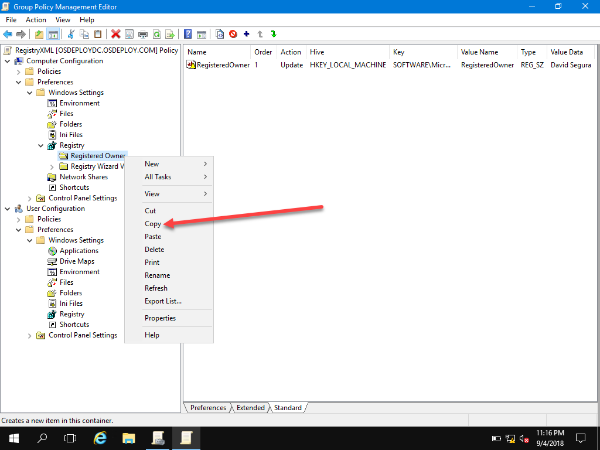
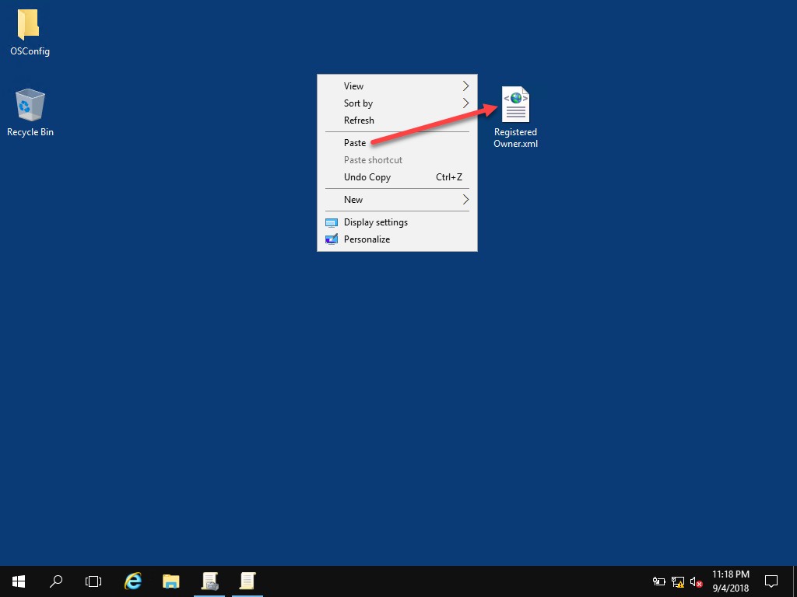
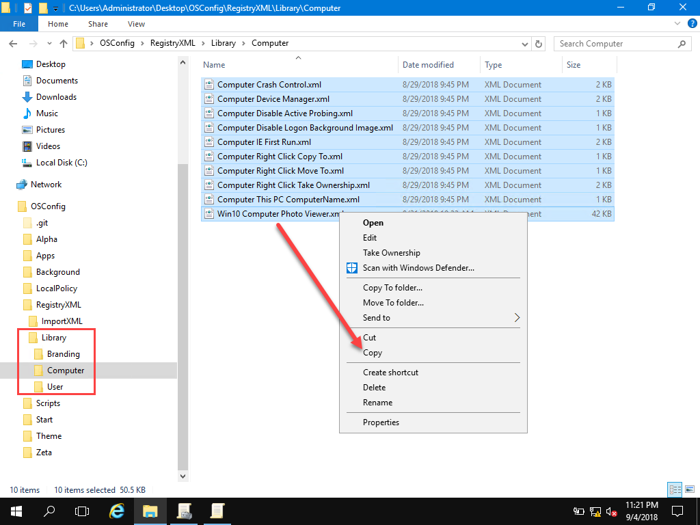
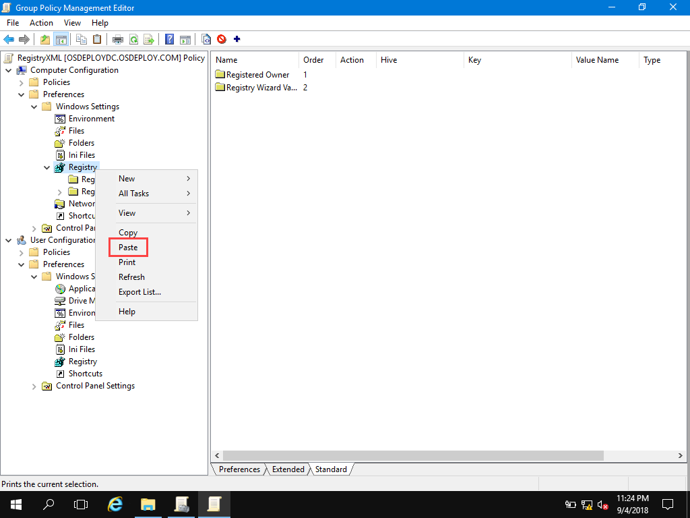
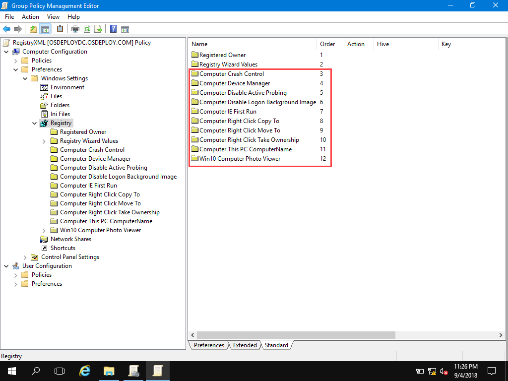
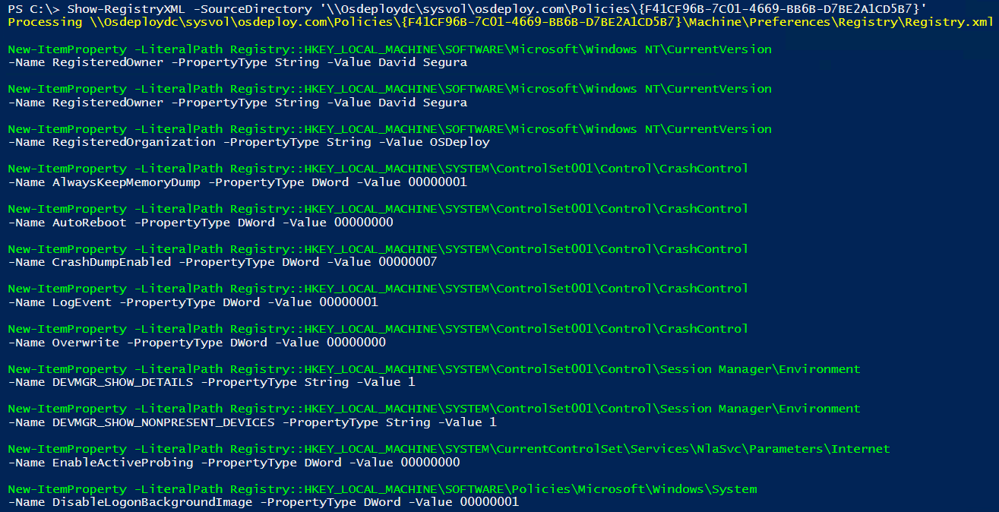

# RegistryXML Files

While the Policy contains a Registry.xml file, you can actually create separate, individual XML files that contain Registry settings.  I call these RegistryXML Files . . . The neat thing about working in Group Policy Management is the fact that you can Copy anything from GPP Registry

And Paste it in Windows

So what does this mean?

## RegistryXML Library

This is why I included a RegistryXML Library as part of OSConfig.  This allows you to select whatever files you want in Windows Explorer, and Copy them to the Clipboard

And Paste them right into Group Policy Management Preferences

## Show-RegistryXML

Works like a champ!

