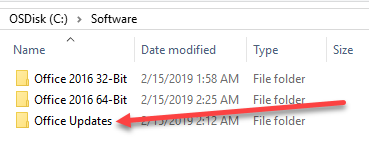
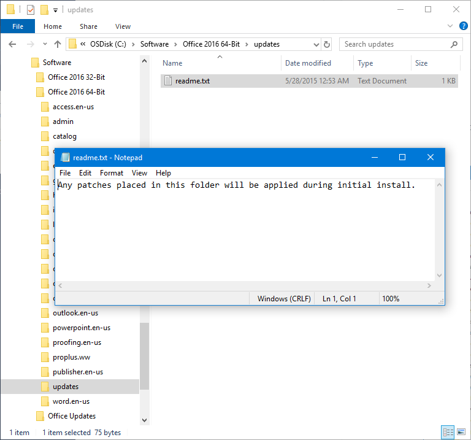
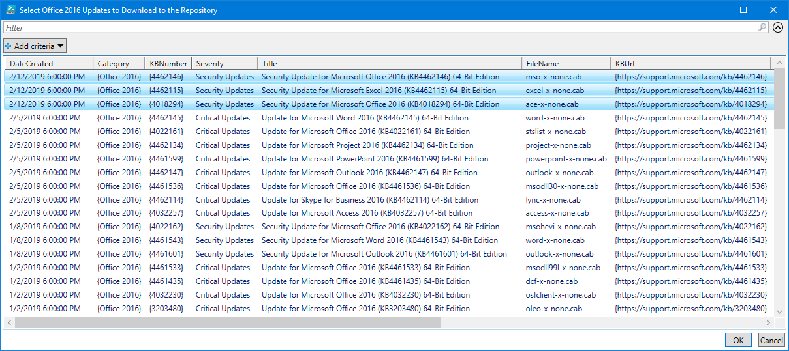
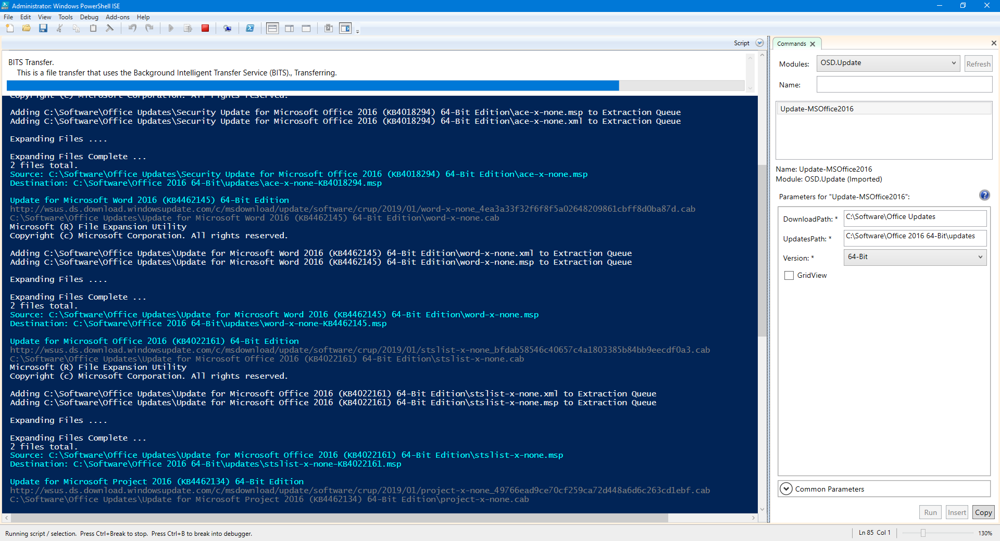
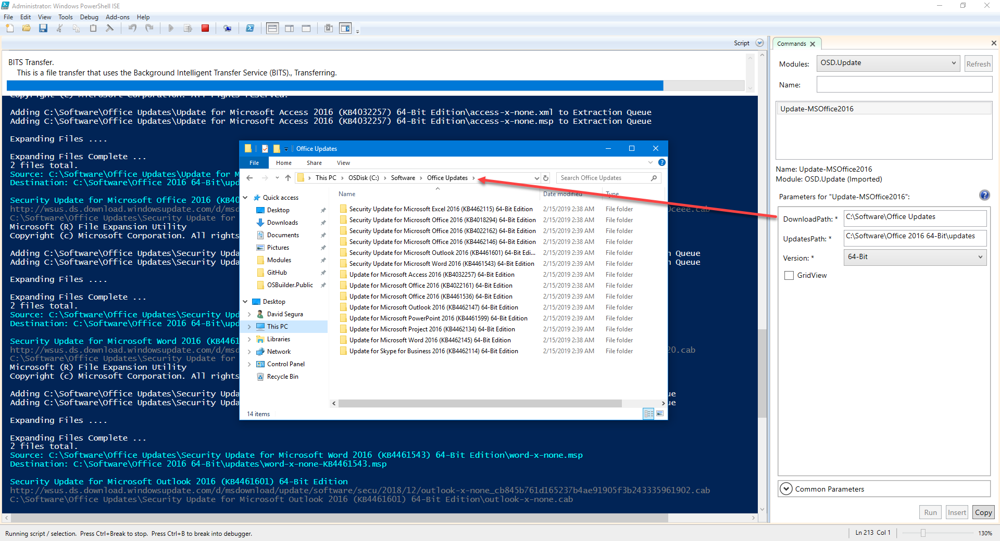
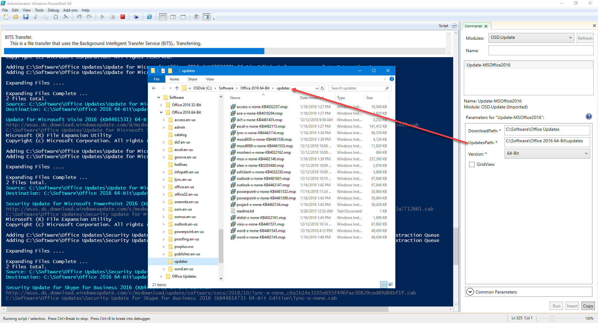
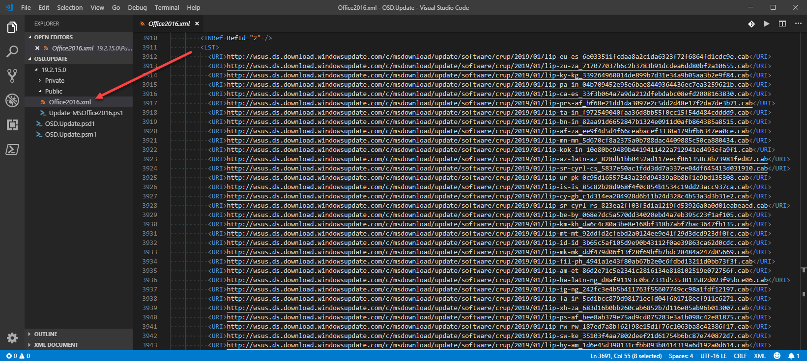

# Update-MSOffice2016

```text
<#
.SYNOPSIS
Updates Microsoft Office 2016 installation Source\Updates directory

.DESCRIPTION
Updates Microsoft Office 2016 installation Source\Updates directory
Requires BITS for downloading the updates
Requires Internet access for downloading the updates

.LINK
https://www.osdeploy.com/osd.update/docs/functions/update-msoffice2016

.PARAMETER DownloadPath
This is the path to download the updates initially.  This should be a repository

.PARAMETER UpdatesPath
This is the Updates directory in your Office 2016 installation source

.PARAMETER Version
Office 2016 32-Bit or 64-Bit

.PARAMETER GridView
Allows you to select Updates to download.  Helpful for initial testing

.EXAMPLE
Update-MSOffice2016 -DownloadPath "C:\Software\Office Updates" -UpdatesPath "C:\Software\Office 2016 32-Bit\updates" -Version 32-Bit
Downloads 32-Bit Update CABs to "C:\Software\Office Updates"
Extracts the MSP files to "C:\Software\Office 2016 32-Bit\updates"
#>
```

## DownloadPath

Before you begin, you will need a DownloadPath directory.  Files are downloaded as CAB files and the MSP files must be extracted.  This can be shared with 32-Bit and 64-Bit updates.



## UpdatesPath

This is the Updates directory in your Office 2016 directory.  This directory should be empty and may contain a **readme.txt** file.  This can stay



## Version

This is specific to your Office 2016 Media.  It will either be 32-Bit or 64-Bit.  This is NOT the architecture of your Operating System

## GridView

This allows you select Updates.  This is useful for initial testing, to make sure things are set properly



## Execution

Once you have everything ready, go ahead and execute



CAB files will be downloaded to the DownloadPath



MSP files will be copied to your UpdatesPath



## Update Logic and Language Updates

Update information is contained in an Office2016.xml file contained in the Module.  This file should contain the latest Microsoft Office 2016 updates as of February 14, 2019.  I'll be working to create an Online Update in the near future, but this was quick and easy.

Additionally Language Updates are not downloaded or visible in GridView, but the download links are in the XML file if you want to add these manually




