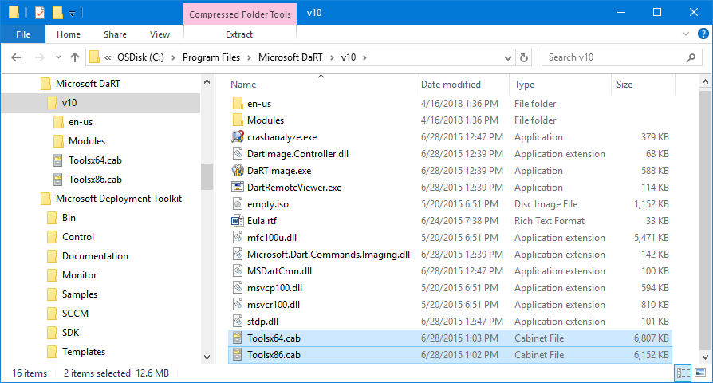
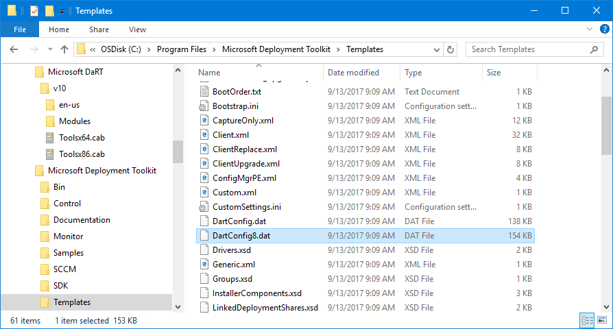
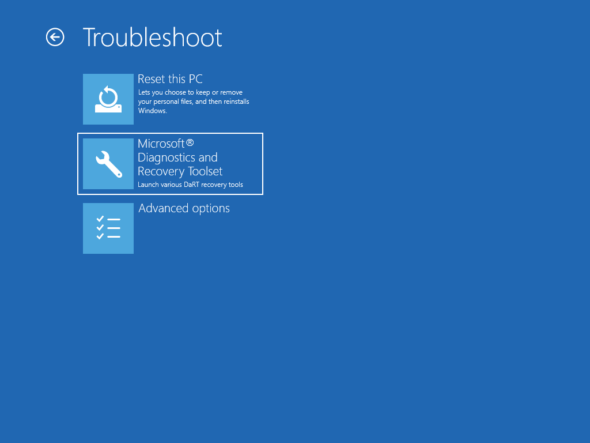
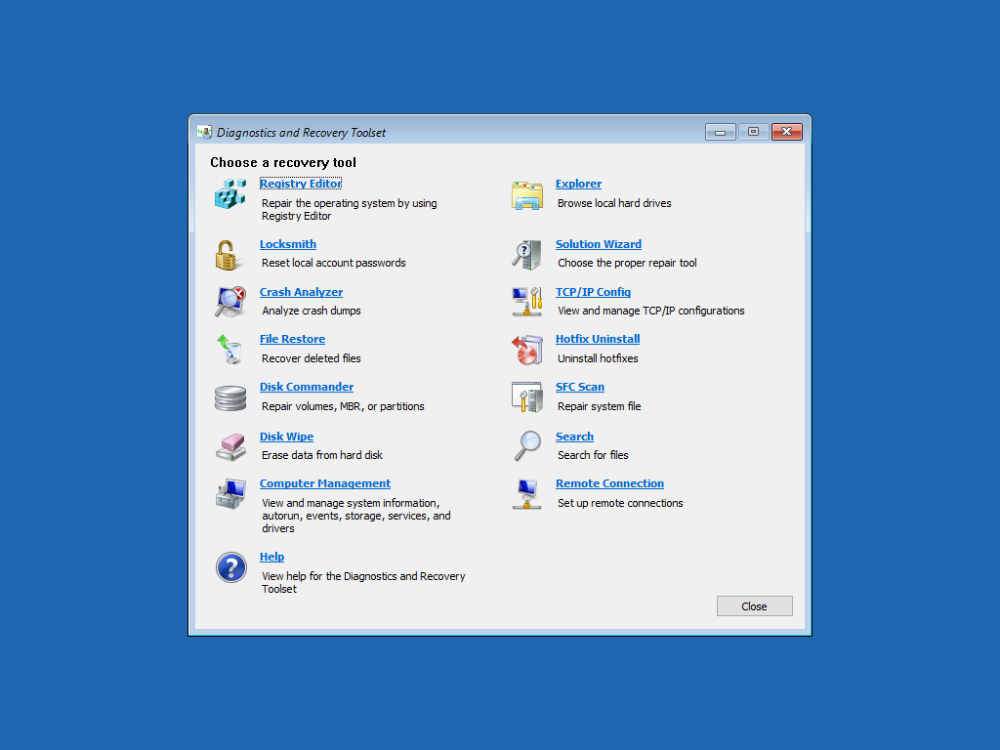

# DaRT


**OSDBuilder 19.4.11+ uses Content\DaRT by default.  Previous versions of OSDBuilder use Content\WinPE\DaRT.  You may continue to use the previous location without issues**



**Microsoft DaRT is not freely available.  It is part of the Microsoft Desktop Optimization Pack \(MDOP\)**


## Purpose

The purpose of the **OSDBuilder\Content\DaRT** directory is to contain the Microsoft Diagnostics and Recovery Toolset files.  These files are used for customizing OSBuilds and PEBuilds

You can add Microsoft DaRT to the WinPE and WinRE images using OSBuilder in a few steps. If you don't know what DaRT is, have a quick read



## Install DaRT and MDT

Install Microsoft DaRT with all defaults.  You can use DaRT to create a DaRT Config, or you can obtain the DaRT Config from Microsoft Deployment Toolkit

## DaRT CAB Files

In "C:\Program Files\Microsoft DaRT\v10" locate the Toolsx\*.cab files and copy them to the following location in OSDBuilder

```text
OSBuilder\Content\\DaRT\DaRT 10
```



## DaRT Config \(MDT\)

In "C:\Program Files\Microsoft Deployment Toolkit\Templates" copy the **DartConfig8.dat** the following location in OSBuilder \(The DartConfig.dat is for an older version of WinPE\)

```text
OSDBuilder\Content\WinPE\DaRT\DaRT 10
```



## Proper File Structure

Here is what your files should look like when configured properly


## Usage

After adding DaRT to OSDBuilder, you will be able to add DaRT to WinPE, WinRE, or WinSE by adding these to an OSBuild or PEBuild Task

When creating a New Task, you should receive a prompt to select the WinPE DaRT Package when using the **ContentWinPEDaRT** parameter


## Validating DaRT in WinRE

After creating an OSBuild or PEBuild, you can create an ISO and test the results. To boot to WinRE from Windows, open an elevated command prompt and enter the following

```text
reagentc /boottore
```

Reboot the computer, and Windows RE should come up





