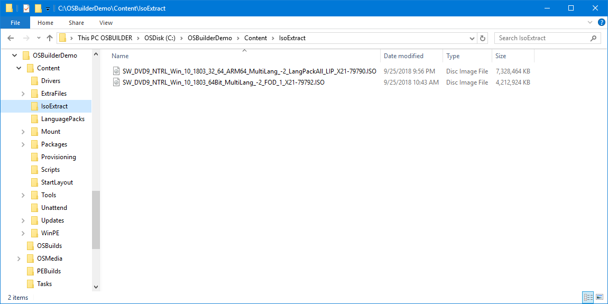
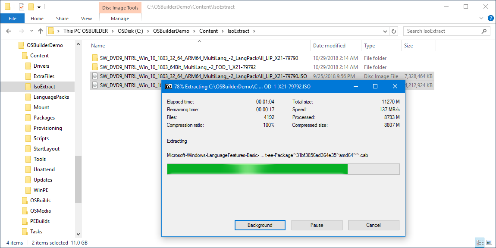
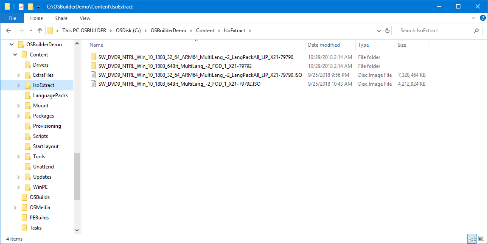
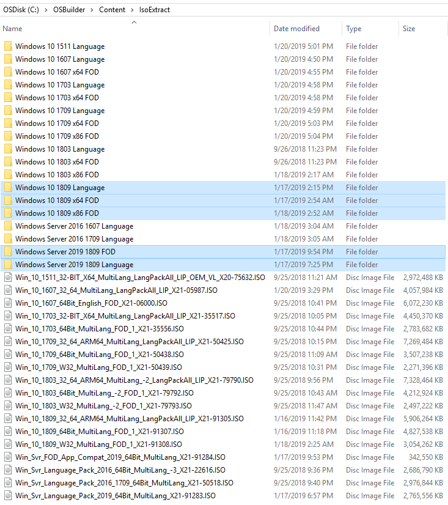
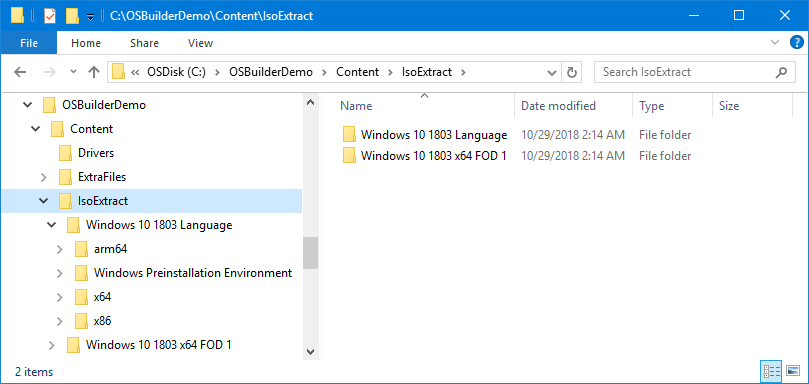
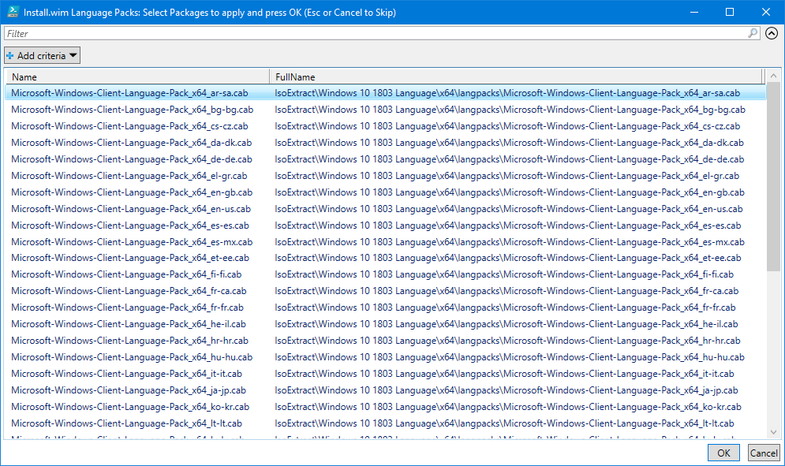
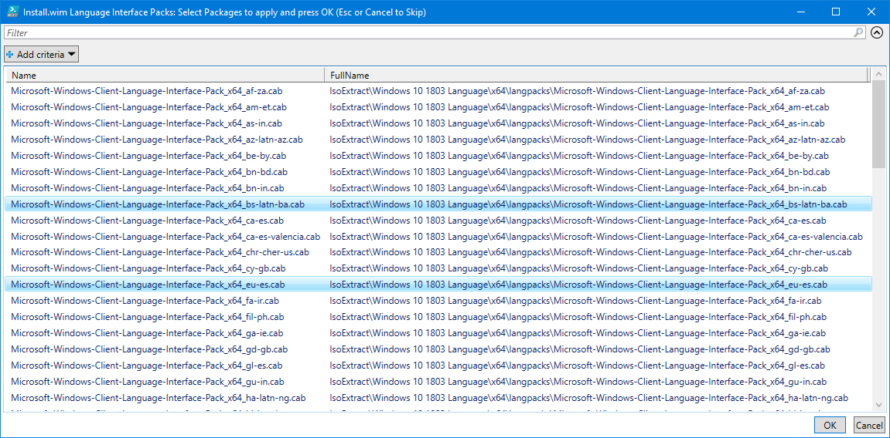
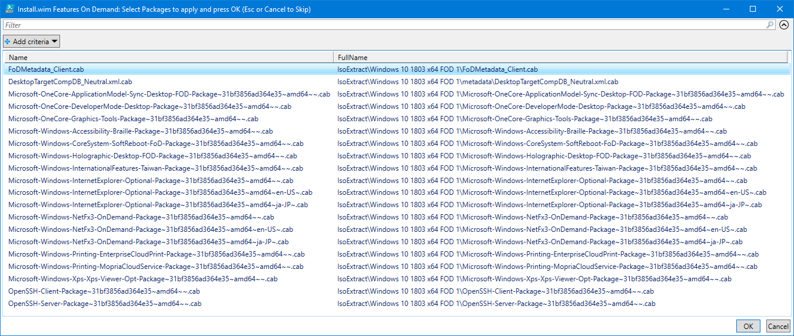
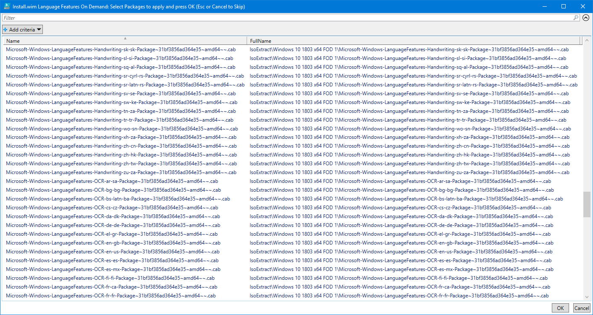

# IsoExtract


**This guide was written for OSBuilder, but the same principals apply to OSDBuilder**


## Strict Directory and File Format

The format of the Drivers Content is Root Directory based.  This means that directories in the root of Content\Drivers can selected in a **`New-OSBuildTask`**


**OSBuilder is scripted to use the extracted ISO's "As-Is".  While you may delete content you will never need \(like Retail CABs\), do not move any content inside the directory structure or you will not see the content properly in New-OSBuildTask**


**IsoExtract** is a directory that can be found at **C:\&lt;OSBuilder&gt;\Content\IsoExtract**

The purpose of this directory is to extract the contents of the following Microsoft ISOs

* **Windows 10 Language Packs**
* **Windows 10 Features On Demand**
* **Windows Server 2016 Language Packs**
* **Windows Server 2019 Language Packs**
* **Windows Server 2019 Features On Demand**

## Download ISO

Download of Copy the Microsoft ISOs into the **C:\&lt;OSBuilder&gt;\Content\IsoExtract** directory

## Extract ISO

Using a tool like 7zip, extract the ISOs

## Rename Directories

Give the extracted ISO in the following format:

* Windows 10 &lt;ReleaseId&gt; Language
* Windows 10 &lt;ReleaseID&gt; &lt;Arch&gt; FOD
* Windows Server 2016 &lt;ReleaseId&gt; Language
* Windows Server 2019 &lt;ReleaseId&gt; Language
* Windows Server 2019 &lt;Release Id&gt; FOD

## Remove ISOs

No need to keep the ISOs once they are extracted

## Language Packs

When adding the **Language Pack ISO** to the **IsoExtract** directory, creating a [**`New-OSBuildTask`**](../../../../osbuilder/docs/functions/osbuild/new-osbuildtask/) will enable the prompt to select **Language Packs**

## Language Interface Packs

When adding the **Language Pack ISO** to the **IsoExtract** directory, creating a [**`New-OSBuildTask`**](../../../../osbuilder/docs/functions/osbuild/new-osbuildtask/) will enable the prompt to select **Language Packs**

## Features on Demand

When adding the **Features on Demand ISO** to the **IsoExtract** directory, creating a [**`New-OSBuildTask`**](../../../../osbuilder/docs/functions/osbuild/new-osbuildtask/) will enable the prompt to select **Features on Demand**

## Language Features on Demand

When adding the **Features on Demand ISO** to the **IsoExtract** directory, creating a [**`New-OSBuildTask`**](../../../../osbuilder/docs/functions/osbuild/new-osbuildtask/) will enable the prompt to select **Language Features on Demand**

