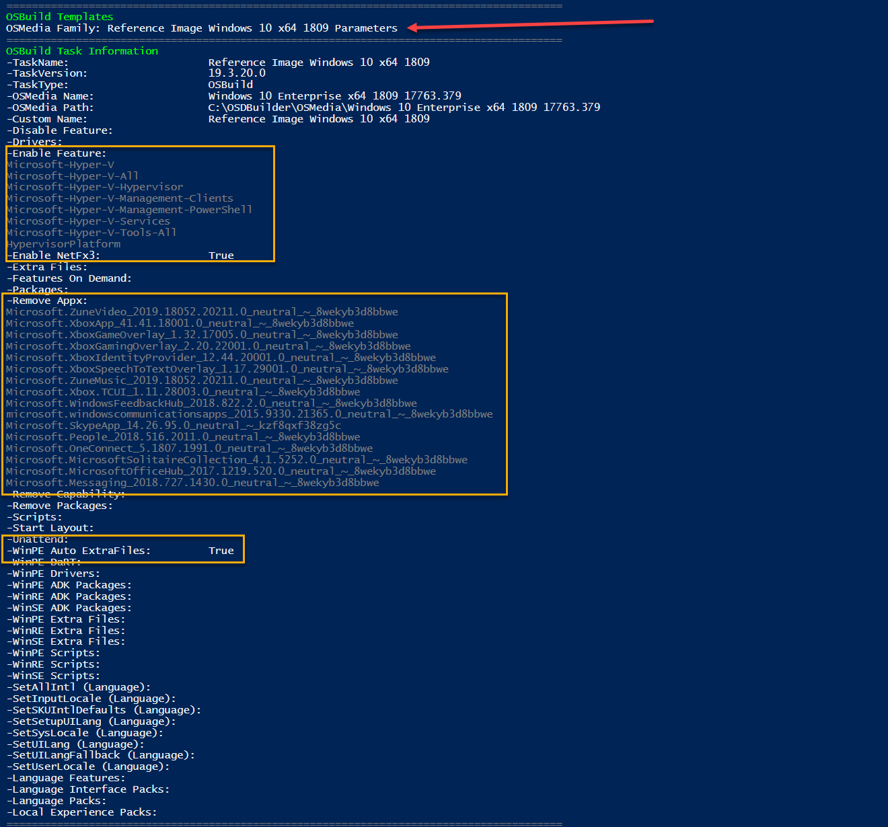

# Add Drivers

**You can easily add Drivers to an OSBuild.  In this example, I'm going to add three must have drivers**

## Intel Wireless

Start by heading to this link



From there you will want to select the latest version.  Hit the Download link

Now download the Zip files you need 

Save the files in your &lt;OSBuilderHome&gt;\Content\Drivers

Expand the Zip and give the directories a friendly name

## Intel Bluetooth

Here is your link for Intel Bluetooth Drivers



Same deal as before, get the latest

Get the Zips that you need

Expand the Zips and give it a friendly name, you know the drill

## Intel Ethernet

Now get the latest Drivers for Intel Ethernet from this link



Make sure you get the latest

Download the Drivers you need.  These should be in EXE format \(self extracting\), but 7-Zip can expand them.  No need to rename these directories, we have some work to do

## Intel Wireless Driver Structure

Checking the Intel Wireless Driver Directory, everything is perfect.  THIS is the format that we need the drivers in.  There is no work to do here

## Intel Bluetooth Driver Structure

These Drivers are NOT going to work.  These are EXE\MSI based, so we need to get these expanded.  Execute the MSI file

And complete the installation

Save these two directories back in your Intel Bluetooth Driver directory in OSBuilder

Like so


If you need Windows 10 x86 Intel Bluetooth Drivers, you will need to repeat this process on a system with Windows 10 x86


## Intel Ethernet Driver Structure

This is the tricky one, so please keep up.  Give the extracted drivers a friendly name.  Now create empty directories for as many Operating Systems that you support in OSBuilder

Delete these selected files, they are not needed

Drilling down into each remaining directory, you will find a readme.txt which tells you what OS is supported

Go through each of the directories and each of the readme.txt.  Delete the directories you don't care about, and move the ones you do care about into the appropriate Operating System

You may come across a directory without a readme.txt.  Just use some common sense \(NDIS62 . . . Windows 6.2 . . . Windows 7?\)

You may even come across a readme.txt that has two Operating Systems that you support, so copy them

Eventually you will run into some WinPE Drivers.  Move them where they need to be \(unzip as needed\)

Here is what your Intel Ethernet Drivers look like if you need everything

## WinPE Drivers

Copy these Drivers to your WinPE Drivers

## New-OSBuildTask

Now create a New-OSBuildTask.  You will be prompted to select directories the Directories that you added.  Select the ones that apply to your OS and press OK

Since you copied the Driver directories into WinPE\Drivers, you will be prompted to select Drivers to apply to WinPE.  Select the proper ones \([and yes, you can add Wireless support](https://www.scconfigmgr.com/2018/03/06/build-a-winpe-with-wireless-support/)\)

## New-OSBuild

Now you can execute your Task and the Drivers will be applied automatically, or you can add these as a [Template](../../guides/templates.md) and these will be applied depending on where you save your Template

**During the WinPE processing, the Drivers will be added to Windows Setup \(WinSE\), Windows PE \(WinPE\), and in Windows Recovery Environment \(WinRE\) automatically.  So no more not being able to connect to the network when you need to do a Repair**

**During the OS processing, the Drivers that were selected will be automatically added as well**

## Summary

You can add more drivers as needed, and I hope this helps explain how Drivers work in OSBuilder.  Enjoy

