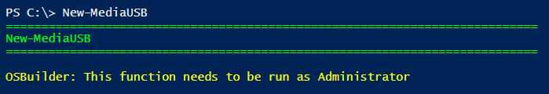
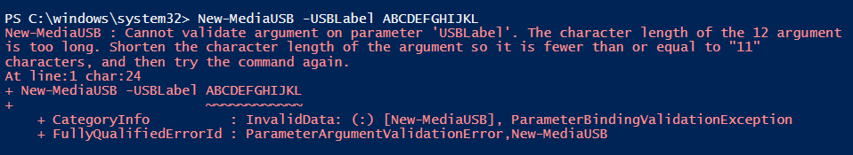
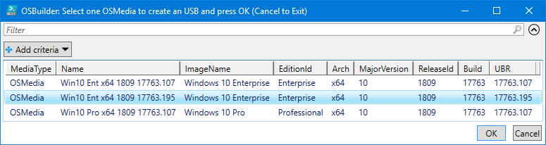
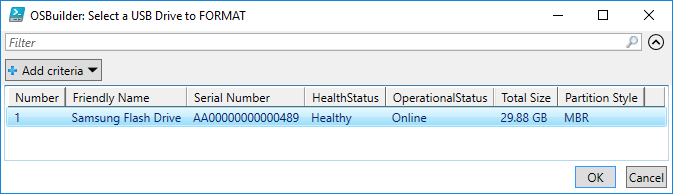
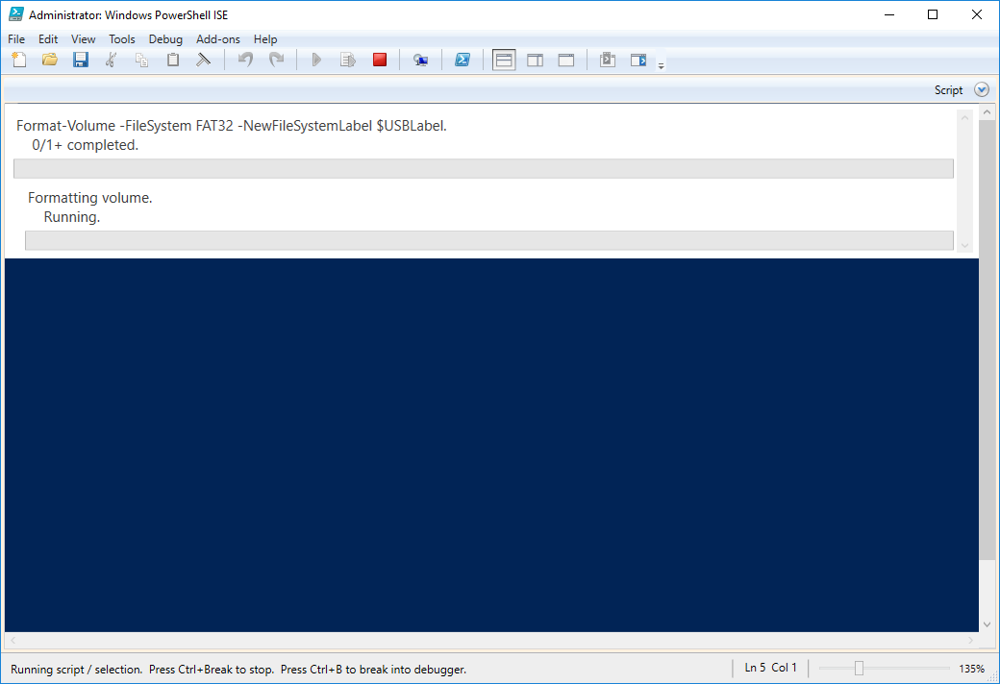
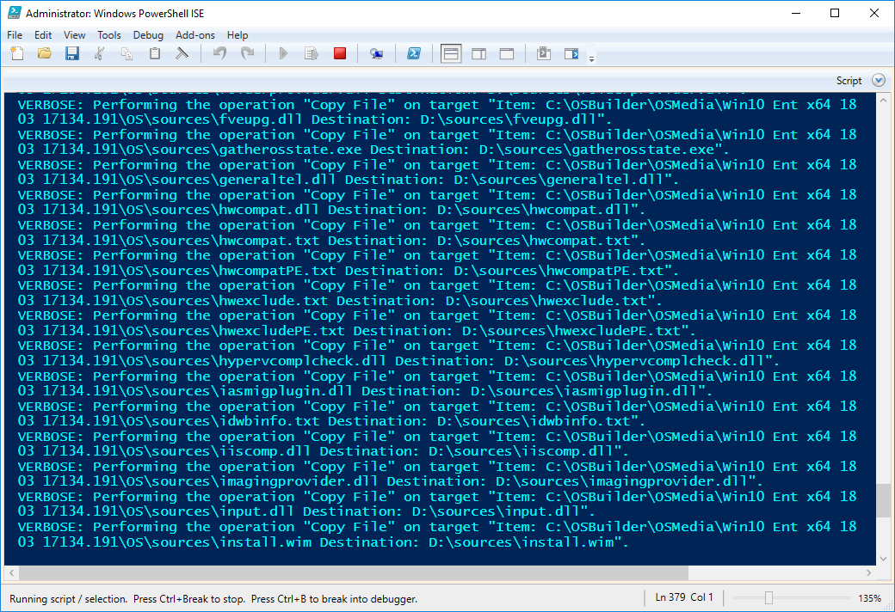
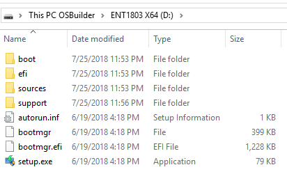

# Create a USB

## New-OSBMediaISO

To create an USB, you need to use **`New-OSBMediaUSB`**



## Requirements

## Requirements

* WIM must be smaller than 4GB.  This is a FAT32 limitation
* USB Drive must be 32GB or smaller.  This is a FAT32 limitation
* Admin Rights are required

## -USBLabel ABCDEFGHIJKL

The USB Drive Label cannot exceed 11 characters \(FAT32 limitation\). You have been warned.

## Select OSMedia or OSBuild

Select a single OSMedia or OSBuild to copy to the USB

## Select USB Drive to FORMAT

Warning, this will replace everything on the USB Drive so be careful

## Execution

Your USB Drive will be wiped

And files will be copied. Be patient, especially when it starts copying the Install.wim

## Complete

Enjoy!

