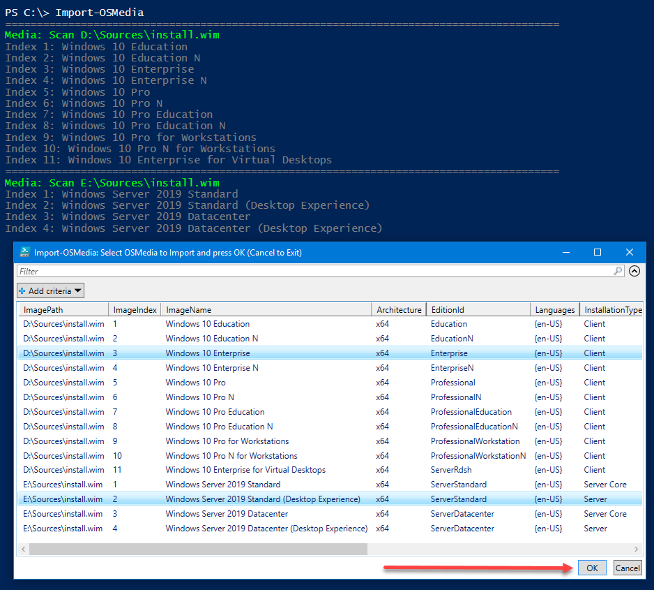
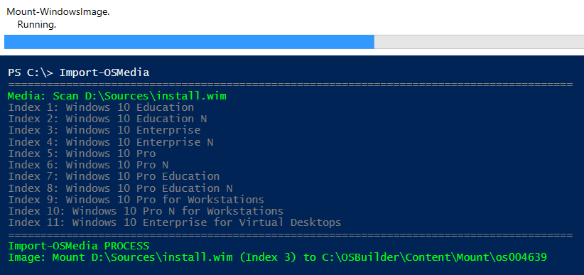
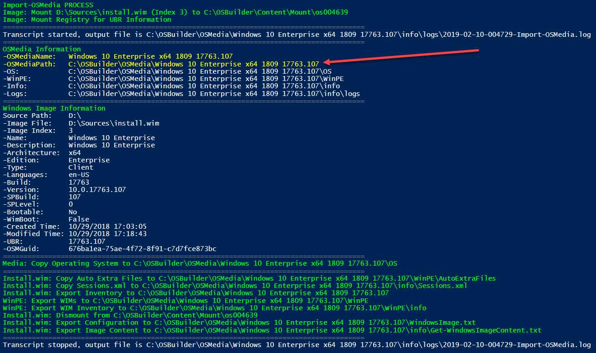
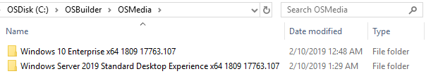

# Import an OS


**Open PowerShell with Admin Rights**


## Windows Media

You will need to Import an Operating System to use with OSBuilder.  This must be done with the original DVD or a mounted ISO.  You can use any of the following Media

* \*\*\*\*[**Microsoft Volume Licensing Service Center**](https://www.microsoft.com/Licensing/servicecenter/default.aspx) **\(MVLS\) ISO**
* \*\*\*\*[**Microsoft Developer Network**](https://msdn.microsoft.com) **\(MSDN\) ISO**
* \*\*\*\*[**Microsoft Media Creation Tool**](https://www.microsoft.com/en-us/software-download/windows10) **\(ESD Format\) ISO**

## Import-OSMedia

Once you have the DVD or ISO mounted, you can import the Operating System.  In PowerShell, simply enter the following command

```text
Import-OSMedia
```

OSBuilder will scan the drives for an Operating System to import and display the results in GridView.  Simply select the Operating System you want to import and press OK


**You can multi-select multiple Editions from multiple ISO's at the same time**




The Operating System then will be mounted



Once mounted, a full inventory will be saved, and the Operating System will be copied into OSBuilder's OSMedia.  This will take between 5-10 minutes to complete per Operating System Edition






