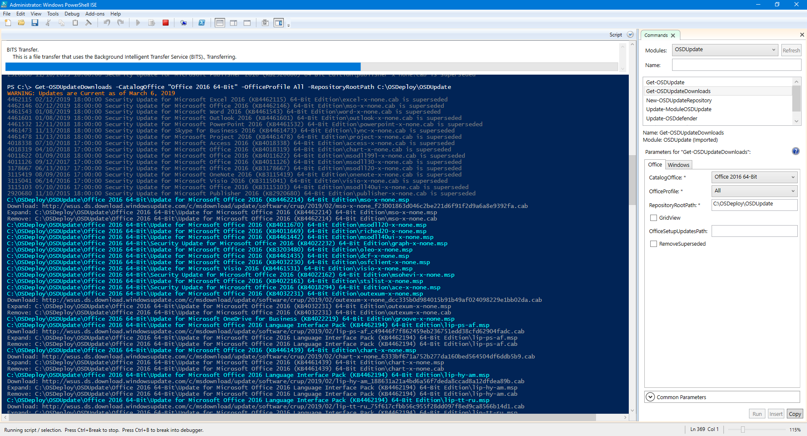

# OSBuild Validate

## Prerequisites







## Functions



## New-OSBuild

You should first validate your **OSBuild** by using **New-OSBuild** without any parameters

The first step is to select an **OSBuild Task** and press OK.  Its important to note that this OSBuild Task was created with a **UBR of 17763.107**

### OSBuild Task Information

The OSMedia that was used to create the **OSBuild Task** will be displayed, as well as the **OSBuild Configuration**

### Updated Source OSMedia

The problem is that I seem to have an updated **OSMedia** that should be used

This is not an issue as **OSDBuilder** will automatically select the latest release


**Use the DontUseNewestMedia parameter if you do not want to use the latest OSMedia**


### Task Templates

**OSDBuilder** will search the Templates directory for Tasks  In this case it founds the Task Template created in the previous section which contained NetFX3, WinPE AutoExtraFiles, Appx Provisioned Packages, and Enabled Hyper-V.  


**To skip using Templates, use the SkipTemplates parameter**


### Content Templates and Updates

The remainder of the information relates to **Content Templates** and **Updates**

