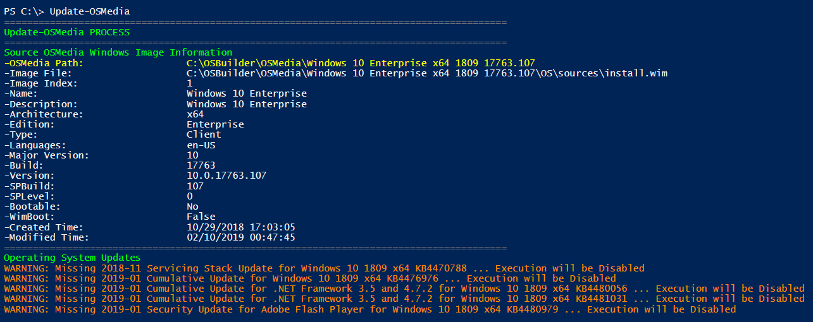
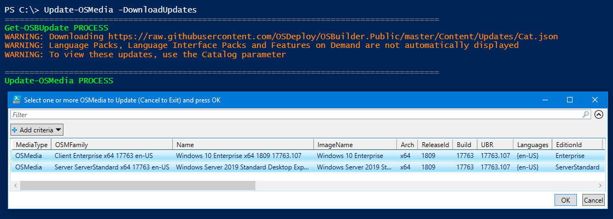
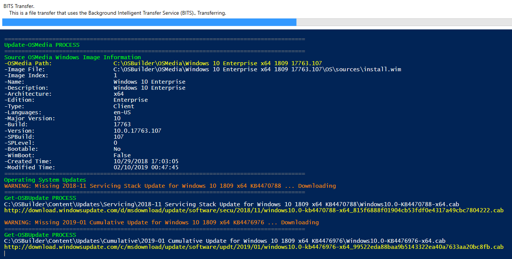
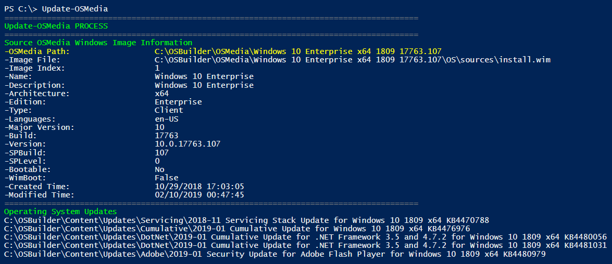
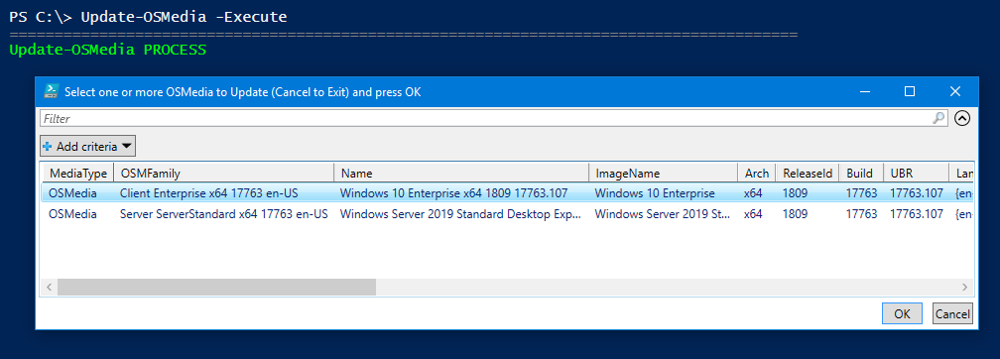
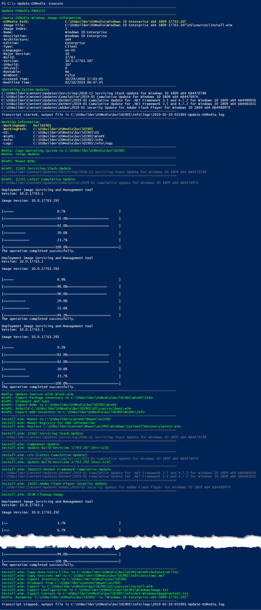

# Update OSMedia

OSBuilder makes it easy to update any Imported Operating System with the latest Microsoft Updates.  Once you have completed this page, you can import the updated OS into MDT or ConfigMgr


**OSMedia is an Imported or Updated OS without any customizations**


## Update-OSMedia

To view the required Updates for any OSMedia, simply use the following PowerShell command

```text
Update-OSMedia
```

A GridView list of OSMedia will be displayed.  Operating Systems that need an update will show no information under the Servicing, Cumulative, or Adobe headings.  Select an OSMedia and press OK


The required Microsoft Updates will be displayed.  If they have not been downloaded yet, you will receive a warning



## Update-OSMedia -DownloadUpdates

To download the required Microsoft Updates for an OSMedia, simply add the -DownloadUpdates parameter

```text
Update-OSMedia -DownloadUpdates
```

This parameter will automatically update the Microsoft Update Catalogs and you will be prompted to select an OSMedia.  You can multi-select OSMedia to download the updates for multiple Operating Systems



Once selected, the OSMedia will validate the required Microsoft Updates and download any that are missing using Microsoft BITS Transfer


BITS requires an Interactive Login




## Update-OSMedia -Execute

Once you have all your Microsoft Updates downloaded, you can now update the OS.  To verify you have the Microsoft Updates, simply run Update-OSMedia without any parameters, and select the OSMedia to update.  If you don't have any Warnings displayed, then you are good to go



Use the following PowerShell command to start the Update-OSMedia process

```text
Update-OSMedia -Execute
```

Select one or more OSMedia to Update and press OK




This process will take between 30 minutes and 2 hours to complete on a good system.  Plan on taking a break while the process is running and make sure you do not have an AntiVirus On Access Scan running


## Complete Process

The image below is the complete Update-OSMedia process.  Right click and open in a new tab for best results




