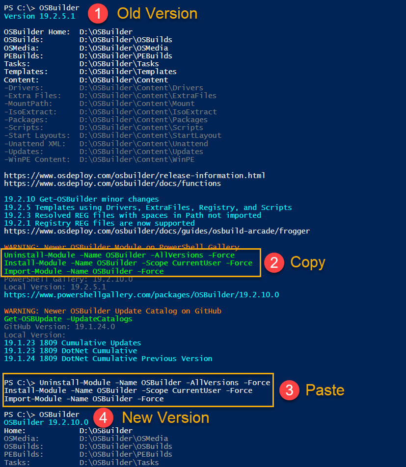
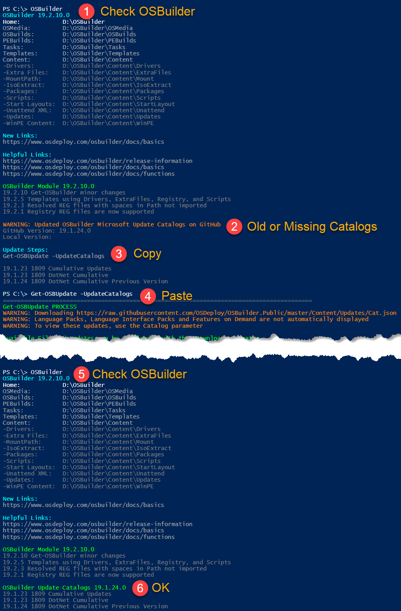

# Update OSDBuilder

**The last page had quite a bit of information, so here is how to update the OSDBuilder Module and the Update Catalogs the easy way**

## **OSDBuilder PowerShell Module**

## OSDBuilder Update Catalogs

