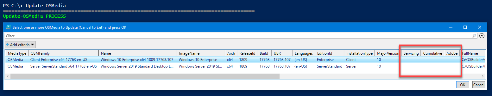

# Update-OSMedia

## Prerequisites



## Functions



## Update-OSMedia

To view the required Updates for any OSMedia, simply use the following PowerShell command

```text
Update-OSMedia
```

A **GridView** list of all existing **OSMedia** will be displayed.  Operating Systems that need an update will show no information under the Servicing, Cumulative, or Adobe headings.  Select an existing **OSMedia** and press OK



The required Microsoft Updates will be displayed.  Updates that have not been downloaded yet will show as Missing


## Update-OSMedia -Execute \(Missing Update\)

When you are ready to update an **OSMedia**, use the **`Execute`** parameter

```text
Update-OSMedia -Execute
```

If you do not have all the Updates downloaded, Execution will be disabled


## Update-OSMedia -Download -Execute

You can add the **`Download`** parameter.  This will automatically download any Missing updates and Execute the Update



**This process will take between 30 minutes and 2 hours to complete on a good system.  Plan on taking a break while the process is running and make sure you do not have an AntiVirus On Access Scan running**


## Complete Process

The image below is the complete Update-OSMedia process.  Right click and open in a new tab for best results


