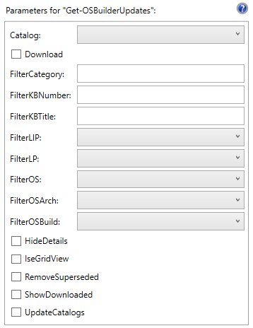
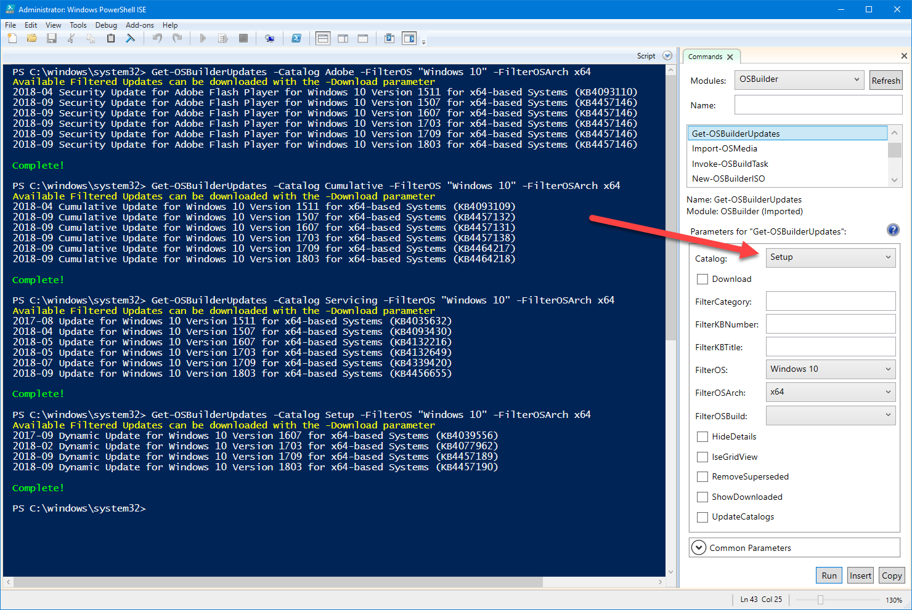
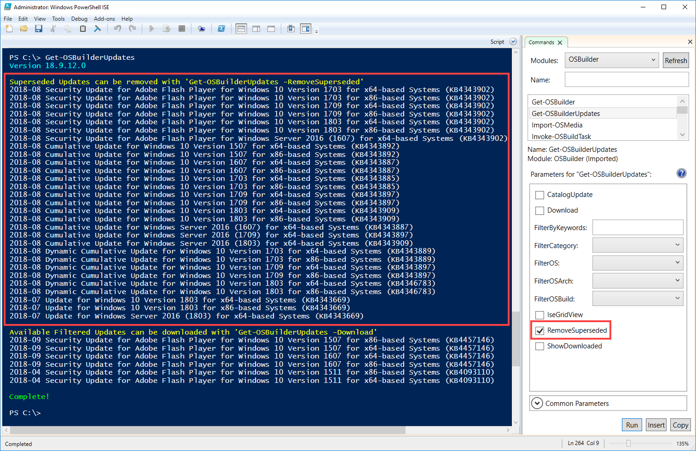

# Get-OSDBuilderDownloads

## Usage

## Comments

```text
<#
.SYNOPSIS
Downloads Microsoft Updates for use in OSDBuilder

.DESCRIPTION
Downloads Microsoft Updates for use in OSDBuilder

.LINK
https://www.osdeploy.com/osdbuilder/docs/functions/get-osdbuilderdownloads
#>
```

## Parameters

```text
[CmdletBinding(DefaultParameterSetName='Basic')]
PARAM (
    #===================================================================================================
    #   Superseded
    #===================================================================================================
    [Parameter(ParameterSetName='Superseded', Mandatory=$True)]
    [ValidateSet ('List','Remove')]
    [string]$Superseded,
    #===================================================================================================
    #   Basic
    #===================================================================================================
    [Parameter(ParameterSetName='Basic')]
    [ValidateSet(
        'Windows 7',
        #'Windows 8.1',
        'Windows 10',
        'Windows Server 2012 R2',
        'Windows Server 2016',
        'Windows Server 2019')]
    [string]$UpdateOS,
    
    [Parameter(ParameterSetName='Basic')]
    [switch]$Download,

    [Parameter(ParameterSetName='Basic')]
    [switch]$GridView,

    [Parameter(ParameterSetName='Basic')]
    [ValidateSet ('x64','x86')]
    [string]$UpdateArch,

    [Parameter(ParameterSetName='Basic')]
    [ValidateSet (1903,1809,1803,1709,1703,1607,1511,1507,7601)]
    [string]$UpdateBuild,

    [Parameter(ParameterSetName='Basic')]
    [ValidateSet(
        'SSU Servicing Stack Update',
        'LCU Latest Cumulative Update',
        'DUSU Setup Dynamic Update',
        'DUCU Component Dynamic Update',
        'Adobe Flash Player',
        'DotNet Framework',
        'Optional')]
    [string]$UpdateGroup,

    [Parameter(ParameterSetName='Basic')]
    [switch]$WebClient
```

## Usage

You may want to download the Microsoft Updates you need before Updating any Operating Systems. **This is not required as you can let** [`Update-OSMedia`](osmedia/update-osmedia.md) **download what you need**, but if you want to get them downloaded first, us this function



When running Get-OSDBuilderUpdates without any parameters, a complete list of downloads will be listed. _\*\*_Optional Downloads like Language Packs, Language Interface Packs, and Features on Demand are not displayed by default. Files that have already been downloaded will not be shown in the list


## Get-OSDBuilderUpdates -UpdateCatalogs

It is necessary to check for updated Catalogs from time to time . . . use this Parameter


## Get-OSDBuilderUpdates -Catalog

You can filter Updates by Catalog. Catalogs are saved in OSDBuilder\Updates as JSON files



## Get-OSDBuilderUpdates -FilterOS -FilterOSArch -FilterOSBuild

Use these parameters to narrow down the OS Compatibility that you need updates for


## Get-OSDBuilderUpdates -Download -ShowDownloaded

The Download parameter will download the files that are available, and ShowDownloaded will include a listing of the Downloaded Updates


## PowerShell ISE GridView

If you are in PowerShell ISE, you can use the **IseGridView** parameter to display a list of available updates. Select the ones you want to download \(use the **Download** parameter\) and press OK


## Remove Superseded

When Catalogs get new updates, old updates will need to be removed. They will be displayed and you can use the **RemoveSuperseded** parameter to delete them



