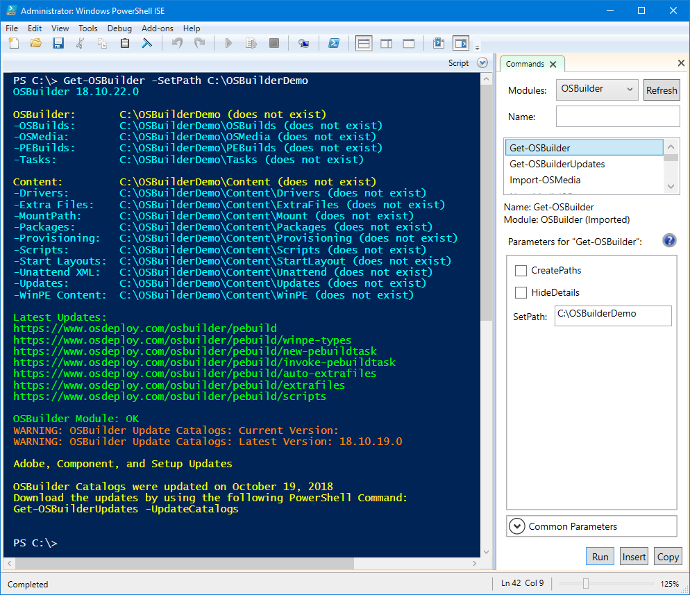

# Set Path

OSDBuilder defaults to C:\OSDBuilder. While this works for most people, it may be necessary to change this from the default. Here are some examples of why you would want to change the path

* Moving OSDBuilder to a larger secondary Drive
* Changing between different OSDBuilder instances
  * Separate Windows 10 from Windows Server
  * Manage OSDBuilder on an External Drive
  * Present a Demo for a Presentation or Training

To change the OSDBuilder path simply use [`Get-OSDBuilder`](./) with the `-SetPath` Parameter

