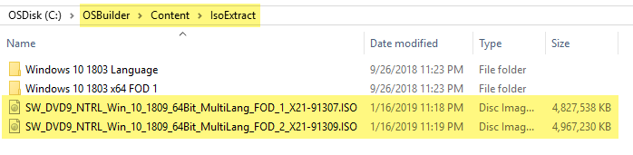
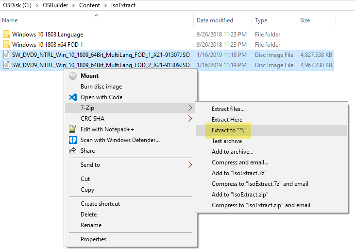
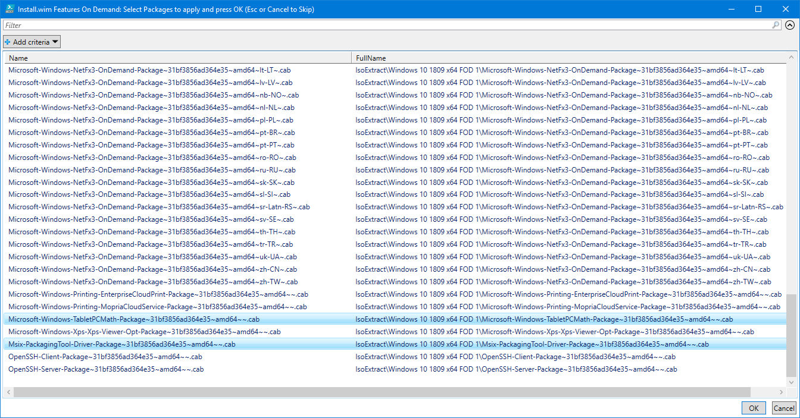
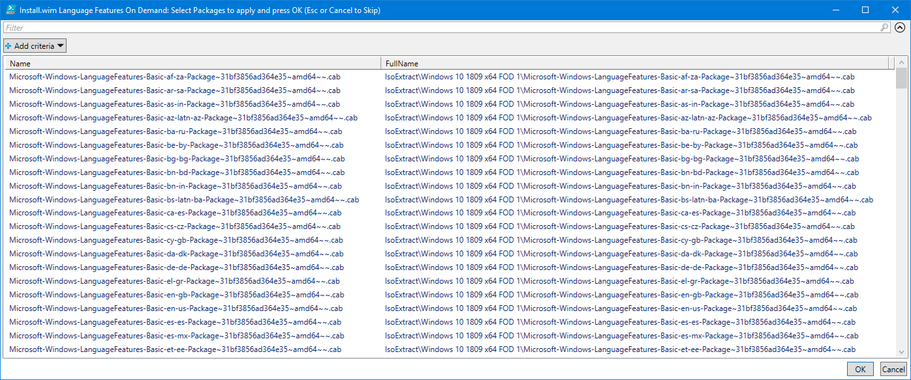
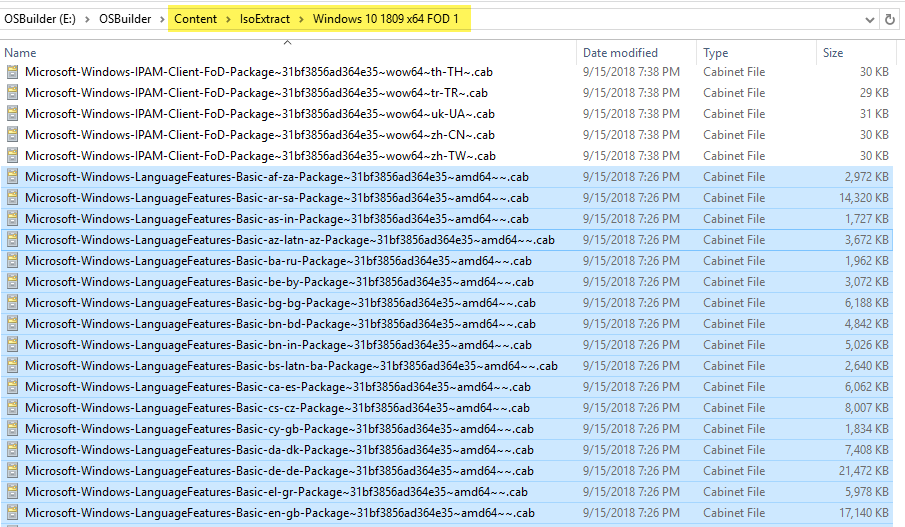

# Features On Demand


You need OSDBuilder 19.1.17+ for this to function properly


To enable Features on Demand, you will first need to Download and extract an ISO from MVLS. Before getting started, make sure you read and understand what new changes there are with Features on Demand for Windows 10 1809



In Microsoft Volume Licensing Service Center I search for '**Windows 10 Enterprise Features on Demand**'. For Windows 10 1809 I see that there are two ISO's that were "**Updated Sept '18**". These ISO's are the ones I need to download \(keep reading first\)

I can now download the ISO's to my OSDBuilder\Content\IsoExtract directory

## IsoExtract Content

The reason this directory is called IsoExtract is because that is what I need to do to this ISO to use it. You can either mount the ISO and copy the files \(with the structure intact\) or use something like 7-Zip to extract the ISO

When looking in FOD Disc 2, I see that it is only Retail Demo content, so unless I'm Best Buy, there is no need to even use this Disc, so I'll delete it

Leaving only FOD Disc 1, which I will give a friendly name, making sure to include the ReleaseId and the Architecture

## New-OSBuildTask

When creating a New-OSBuildTask, I will be prompted to select Features on Demand to include in my OSBuild


See bottom for installing the Windows 10 1809 RSAT Capability


## Language Features

I will also receive a prompt to select Language Features on Demand. I don't want these enabled, so I'll press Cancel to skip

If you never plan on using the Language Features On Demand, simply delete the associated CAB files

## New-OSBuild

When I create a New-OSBuild, the Features on Demand I selected in my Task will be installed automatically

## Results

Easy enough!

## Additional Resources

For help installing the Windows 10 RSAT Capability from the Features on Demand ISO, refer to the following Guide

