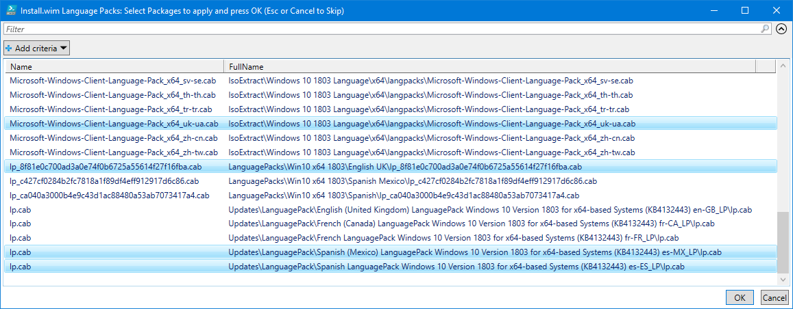
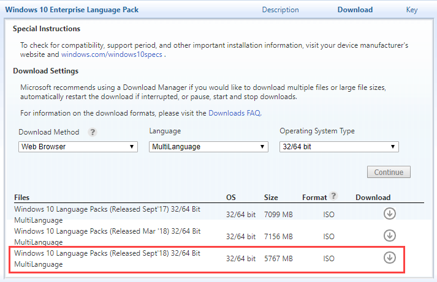
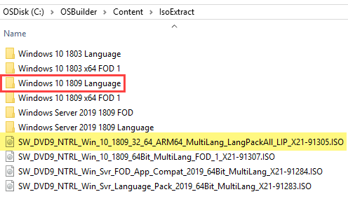

# Language Packs

## Integration Methods

Language Packs can be added to OSDBuilder using the following methods

* **Content\IsoExtract**
  * Download the Language Pack ISO from MVLS
* **Content\Updates\LanguagePack**
  * Use Get-OSBUpdate for Windows 10 1607 - 1803
* **Content\LanguagePacks**
  * Manual copy

## New-OSBuildTask

Select the Language Packs to integrate into an OSBuild

## Download Windows 10 Language Pack ISO

In MVLS search for the Windows 10 Language Pack. All Windows Editions should download the same ISO. The Release Date should correspond with a Windows ReleaseId \(1809 = Released Sept'18\)

## IsoExtract

The ISO should be unzipped using following the IsoExtract Guide



For this purpose I expanded the ISO using 7-Zip and renamed the directory to **Windows 10 1809 Language**

