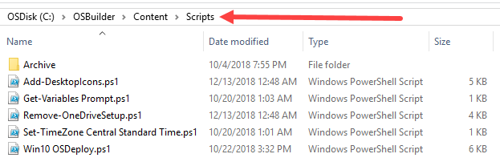
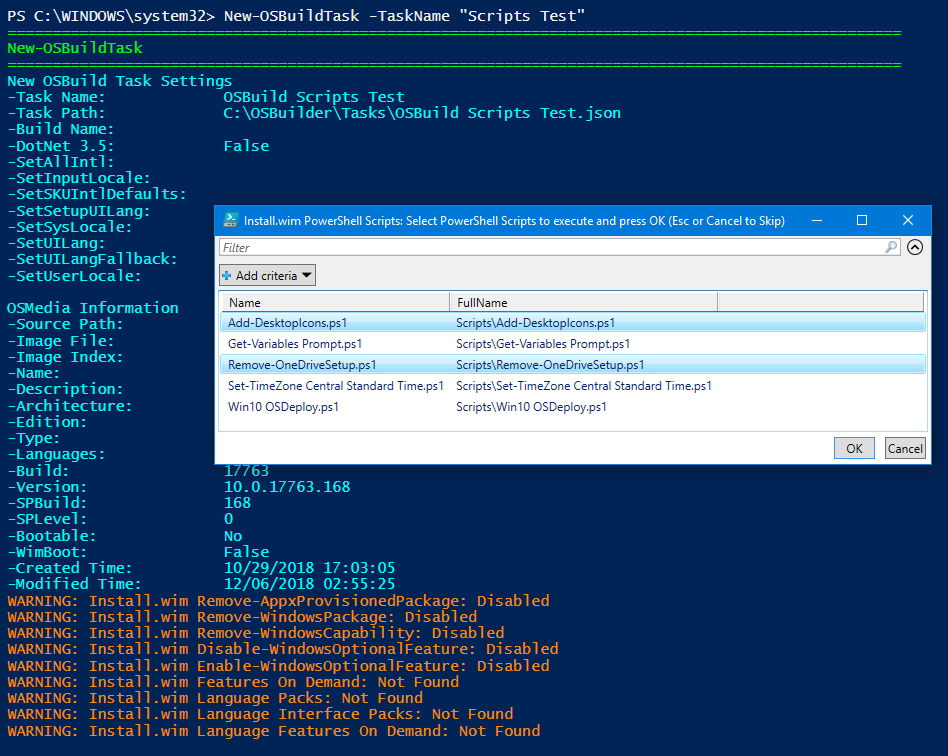
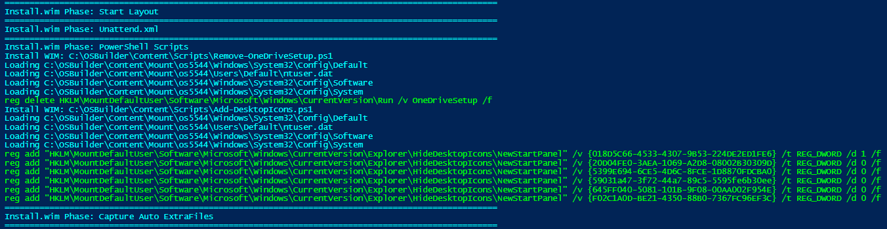
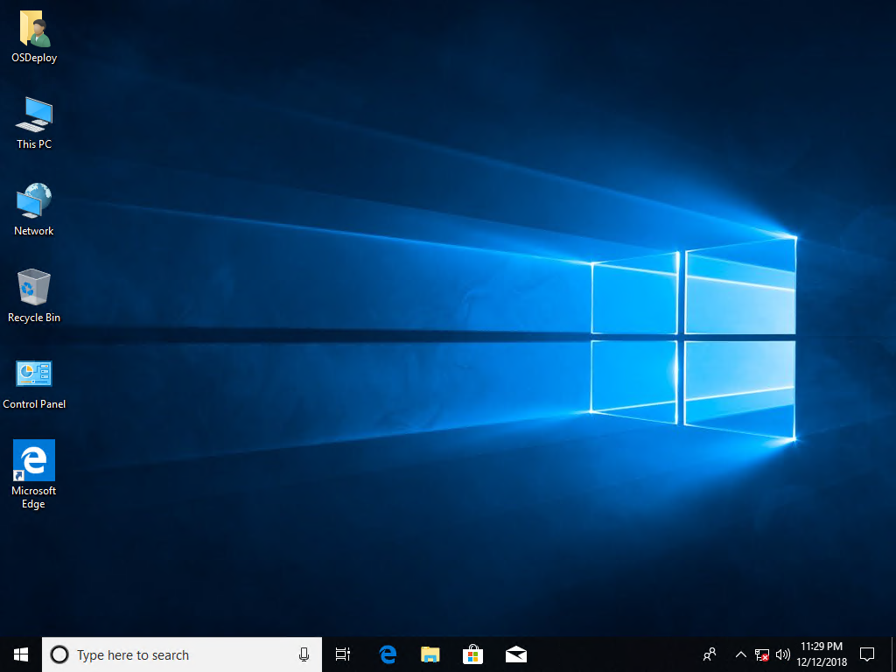
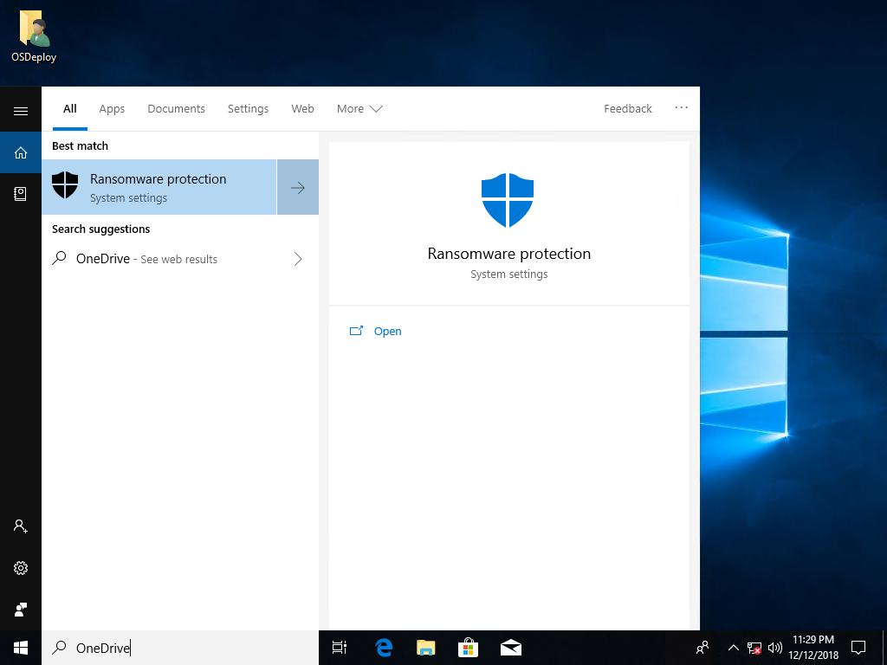

# PowerShell Scripts

There are thousands of customizations that can be added to a Windows Image, and it would be impossible for OSDBuilder to contain Parameters for all of these. This is why New-OSBuild has the ability to execute PowerShell Scripts.

## Add a Script

You can easily add a Script to OSDBuilder by placing the PowerShell Script in the OSDBuilder\Content\Scripts directory

## New-OSBuildTask

Once a PowerShell Script has been added, you can create a [`New-OSBuildTask`](../../new-osbuildtask/) and select the Scripts you want to include

## Edit an Existing New-OSBuildTask

If you know how to edit a JSON file, you can easily add a Script to an existing [`New-OSBuildTask`](../../new-osbuildtask/)**\`\`**



## Remove-OneDriveSetup.ps1

Here is a good example of how to properly format a PowerShell Script to remove OneDrive Setup from the Registry and to delete the Shortcut



## Add-DesktopIcons.ps1

This script will add This PC, Network, and Control Panel to the Desktop for all users



## New-OSBuild -Execute

When executing the [`New-OSBuild`](https://github.com/OSDeploy/GitBook/tree/b3a0aecd45dca9212c45ad9d136ea80419add73b/osdbuilder/docs/functions/osbuild/new-osbuild.md) with the Scripts in the Task, you should see the scripts executed in the PowerShell Console

## Results

The screenshots below should speak for themselves

## OSDBuilder.Public Git

These scripts are available on Github as part of my OSDBuilder.Public Git



## Sharing

If you find this useful, I would appreciate it if you could come up with a script for me to add!

