# Features On Demand

To enable Features on Demand, I will need to Download an ISO from MVLS.  Since I need to add something to OSDBuilder for this to work, this is why it is considered **External Content** as the Features are not included in OSDBuilder

Before getting started, make sure you read and understand what are the available Features on Demand



In Microsoft Volume Licensing Service Center I need to search for '**Windows 10 Enterprise Features on Demand**'.  For Windows 10 1809 I see that there are two ISO's that were "**Updated Sept '18**".  These ISO's are the ones I need to download.

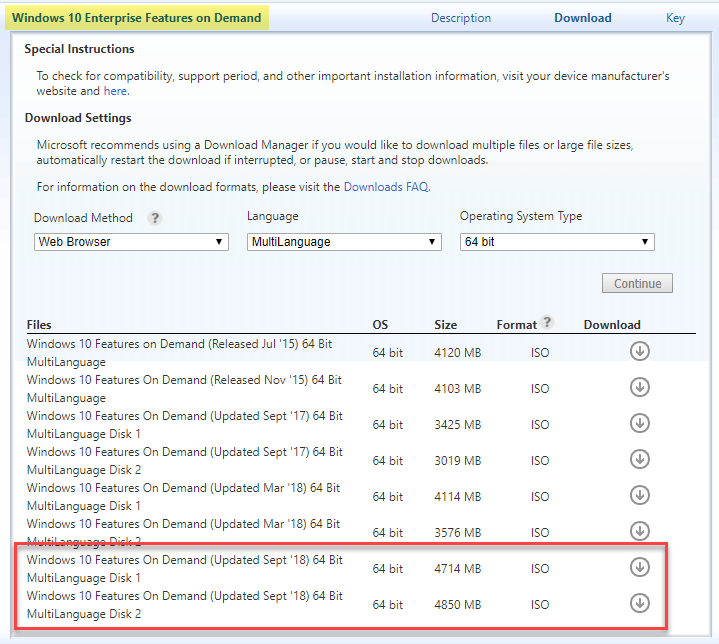

I can now download the ISO's to my OSDBuilder\Content\IsoExtract directory

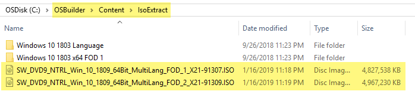

## IsoExtract Content

The reason this directory is called IsoExtract is because that is what I need to do to this ISO to use it.  You can either mount the ISO and copy the files \(with the structure intact\) or use something like 7-Zip to extract the ISO

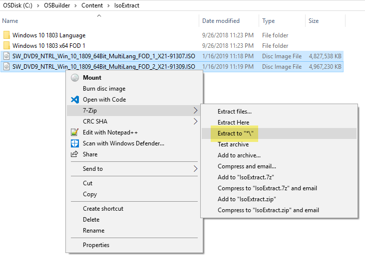

When looking in FOD Disc 2, I see that it is only Retail Demo content, so unless I'm Best Buy, there is no need to even use this Disc, so I'll delete it

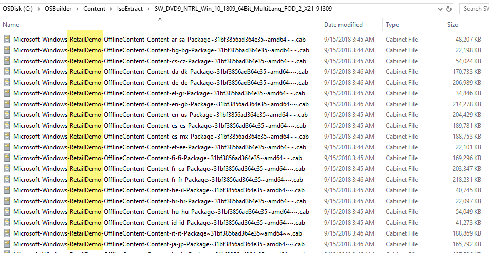

Leaving only FOD Disc 1, which I will give a friendly name, making sure to include the ReleaseId and the Architecture

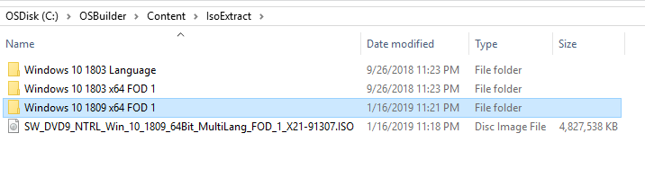

## Windows 10 1809

Starting with Windows 10 1809, Features on Demand are installed as a Capability because they contain Satellite resources.  These Features, such as RSAT should not be selected for installation as they will fail.  You should make sure you read about the changes at this link



To install the RSAT Capabilities, use the following PowerShell script and save it to "C:\OSDBuilder\Content\Scripts\Windows 10 x64 1809 RSAT.ps1"



## New-OSBuildTask

When creating a [**`New-OSBuildTask`**](../new-osbuildtask/), you will be prompted to select Features on Demand.  Make sure you do not include the Features that require Satellite Features \(RSAT\) or press Cancel to skip

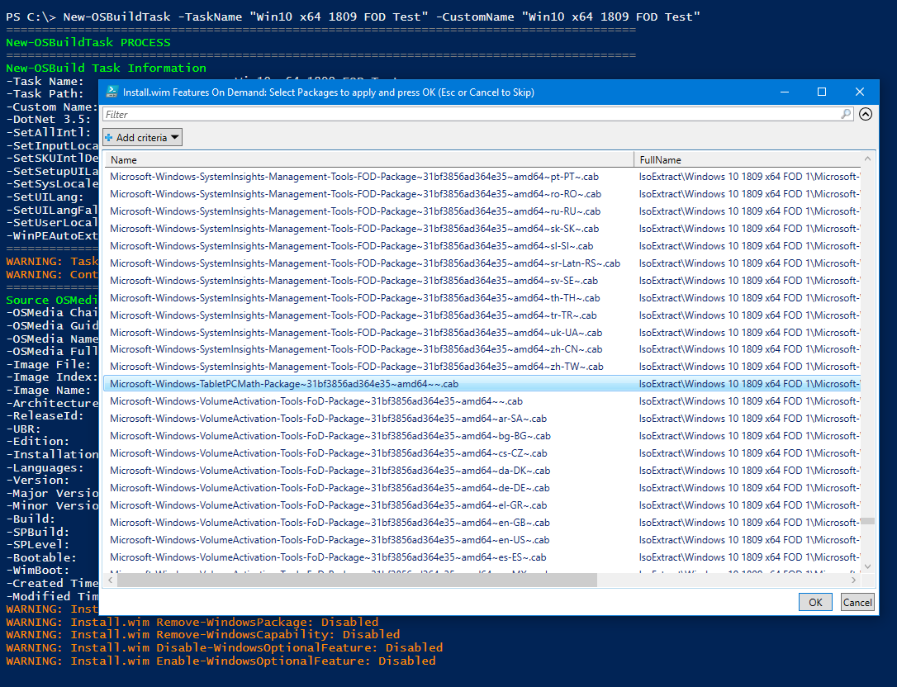

For the Features on Demand, make sure you have a proper PowerShell Script selected when prompted

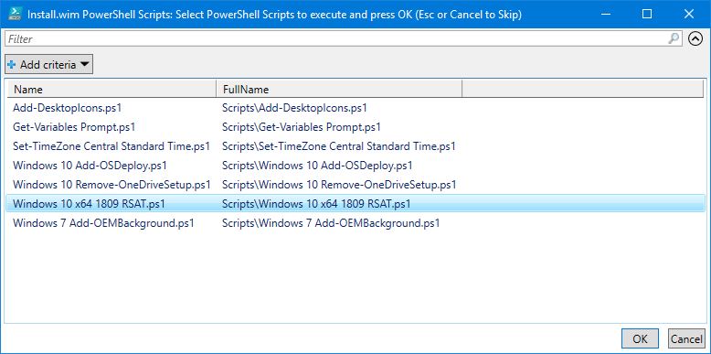

## New-OSBuild

I executing a New-OSBuild, you will see the Features on Demand as well as any PowerShell Scripts that are needed for Satellite Features

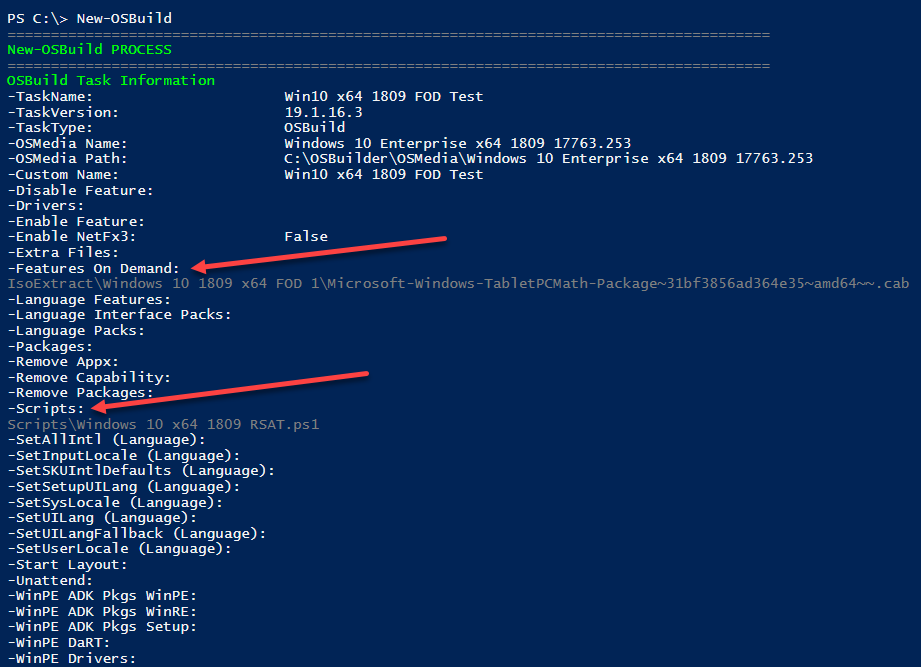

During execution you should see progress for the Features on Demand and the PowerShell Script

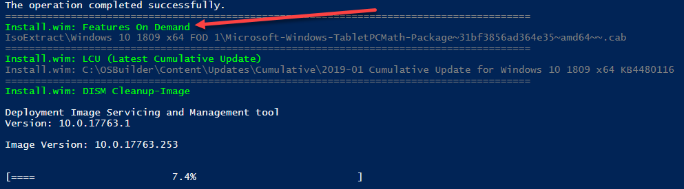

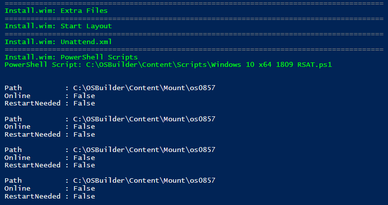

## Testing

For a test, I can create an ISO using [**`New-OSBMediaISO`**](../../osbmedia/new-osbmediaiso.md) and give it an install in a Virtual Machine.  I made sure to disable any Network connections to ensure that everything was installed Offline.  Looks perfect!

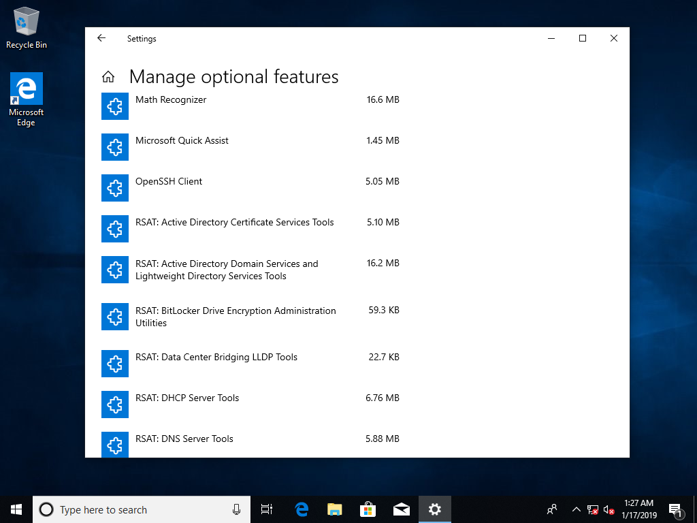

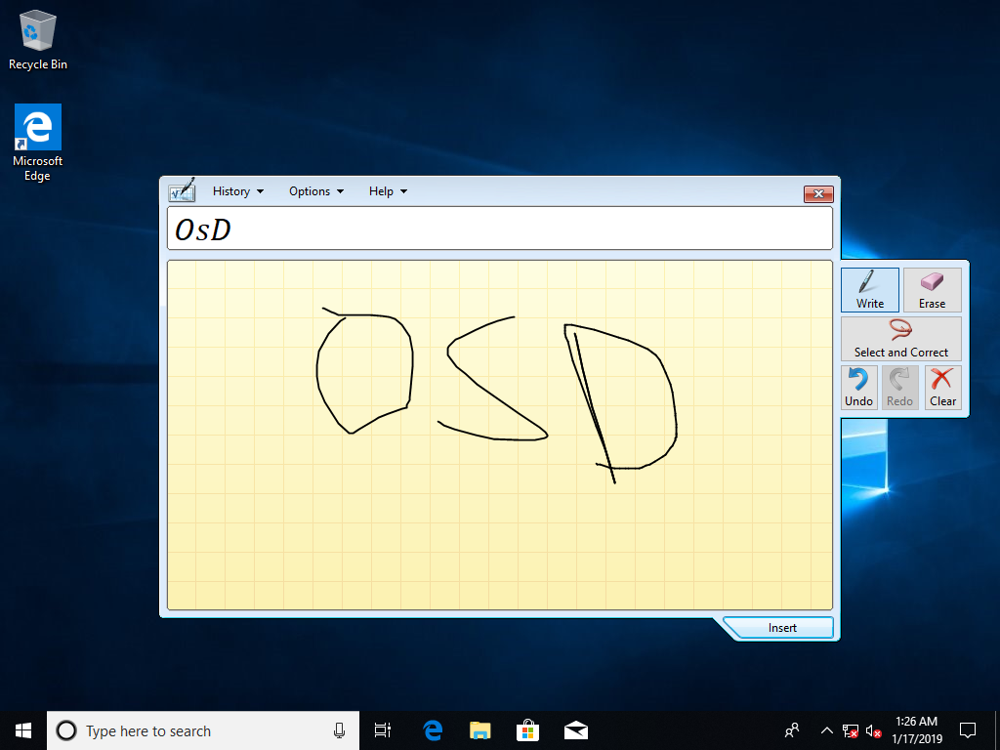

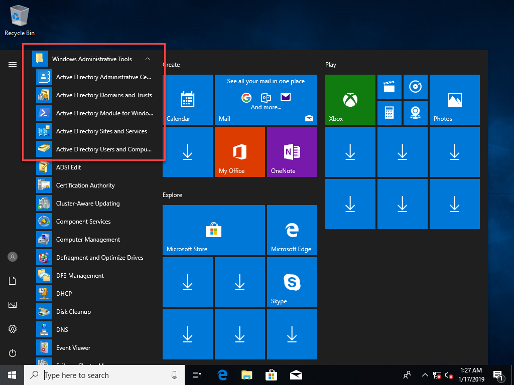

