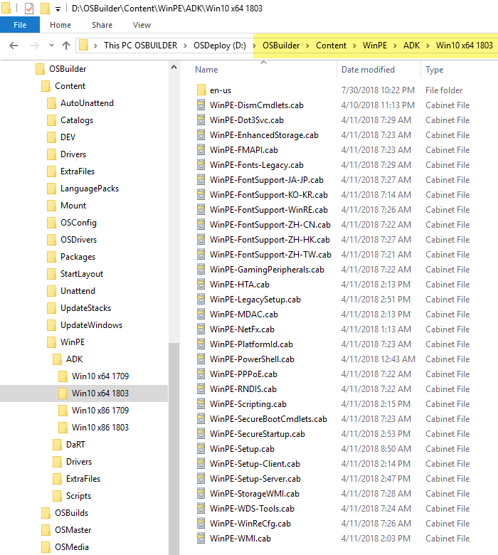
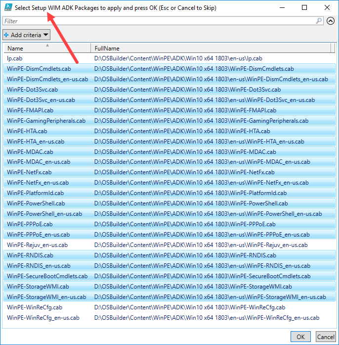
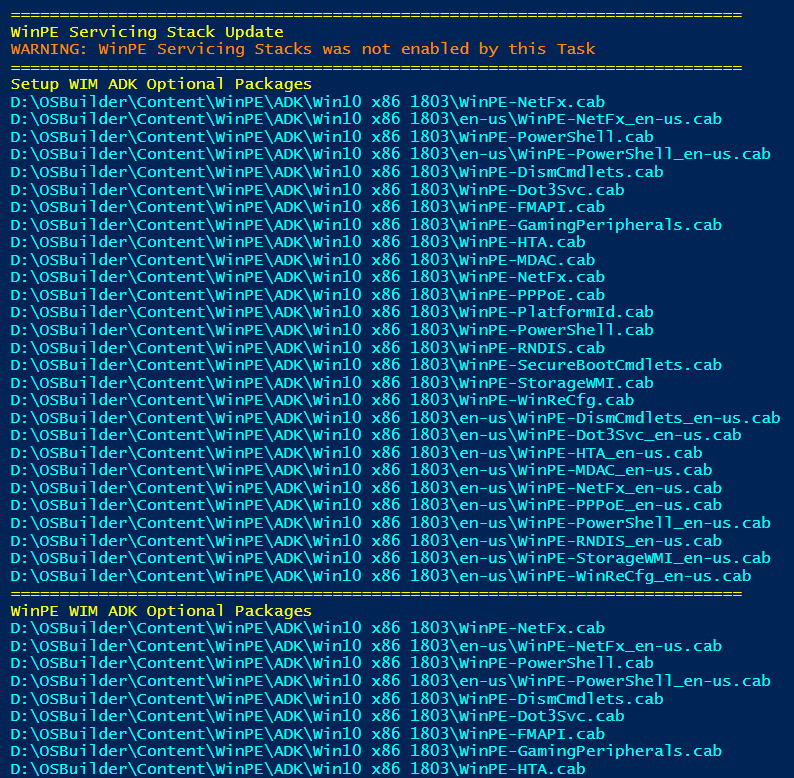
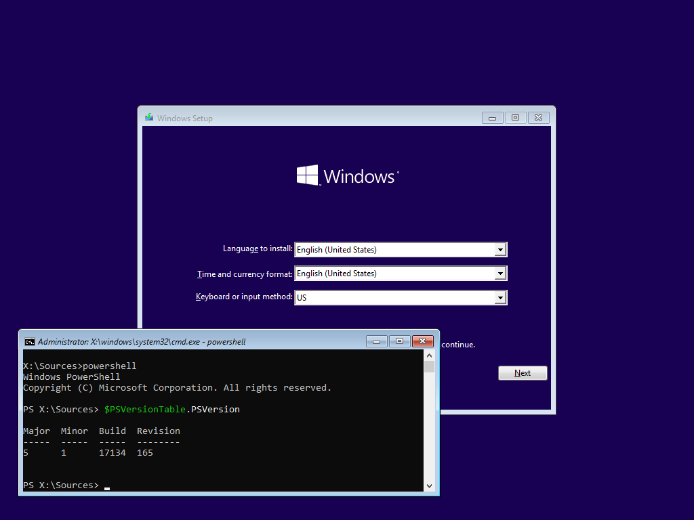

# WinPE ADK Packages


I do not recommend adding any ADK Packages to WinRE unless you account for the increased size in your BIOS System Partition or UEFI Recovery Partition.  Your default Task Sequence should create a 500MB Partition, but this is not enough as it needs a fair amount of free space.

I recommend changing your Partition sizes to 984MB for BIOS System and UEFI Recovery

You have been warned!


Its time to have some fun.  Gather your ADK OC's \(Optional Components\) and Language \(just the one you need\) from these directories

```text
C:\Program Files (x86)\Windows Kits\10\Assessment and Deployment Kit\Windows Preinstallation Environment\amd64\WinPE_OCs
C:\Program Files (x86)\Windows Kits\10\Assessment and Deployment Kit\Windows Preinstallation Environment\x86\WinPE_OCs
```

And add them to OSDBuilder in your corresponding directory in **OSDBuilder\Content\WinPE\ADK\\***



### New-OSBuildTask

Once the files are in place, when you create a new OSBuild Task, you will be promped for each WinPE \(Setup, WinPE, WinRE\) to select the Packages to inject



### Invoke-OSDBuilder

During execution of your Task, the selected ADK Packages will be installed.  You can select different ADK Packages for each WinPE WIM.



### PowerShell in Windows Setup

Because why not?



