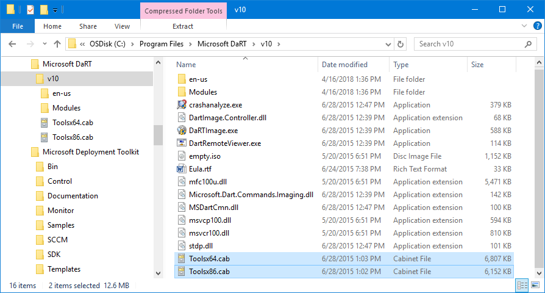
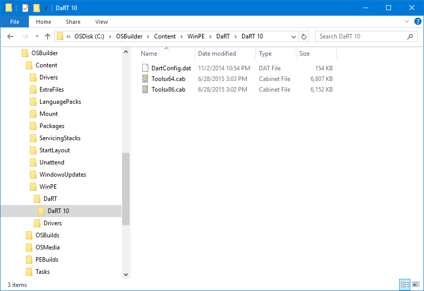
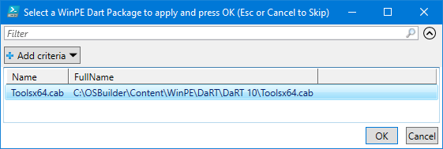
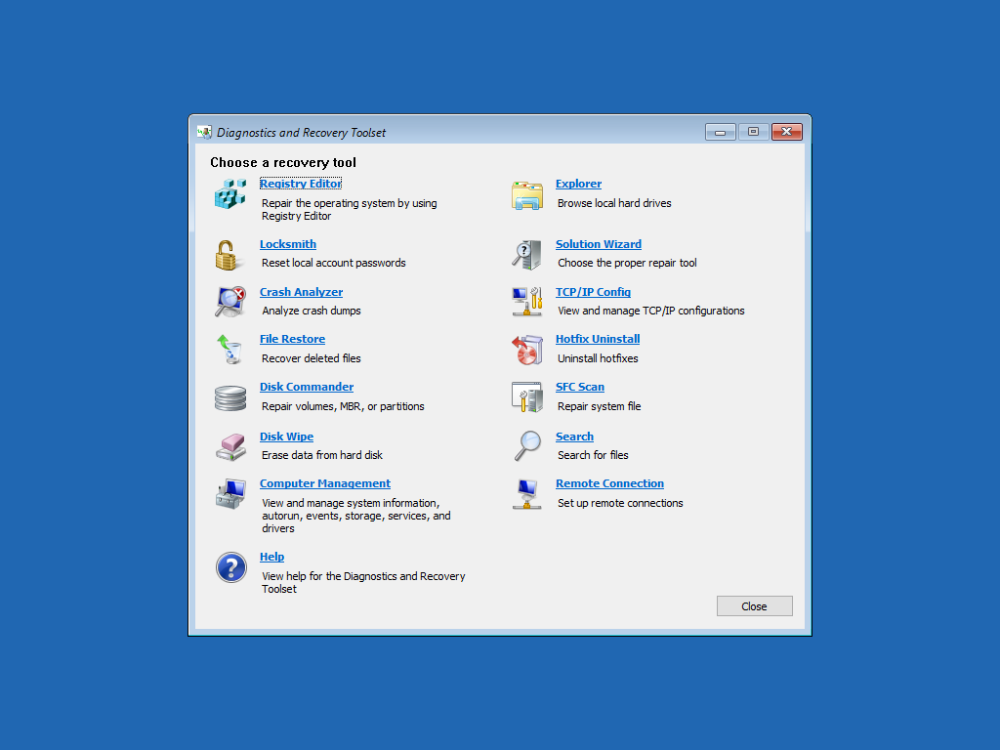

# WinPE DaRT

You can add Microsoft DaRT to the WinPE and WinRE images using OSDBuilder in a few steps. If you don't know what DaRT is, have a quick read

[https://docs.microsoft.com/en-us/microsoft-desktop-optimization-pack/dart-v10/](https://docs.microsoft.com/en-us/microsoft-desktop-optimization-pack/dart-v10/)

## Copy DaRT Tools CAB Files

In "C:\Program Files\Microsoft DaRT\v10" locate the Toolsx\*.cab files and copy them to the following location in OSDBuilder

```text
C:\OSDBuilder\Content\WinPE\DaRT\DaRT 10
```



## Copy DaRT Config DAT File

In "C:\Program Files\Microsoft Deployment Toolkit\Templates" copy the DartConfig8.dat the following location in OSDBuilder \(The DartConfig.dat is for an older version of WinPE\)

```text
C:\OSDBuilder\Content\WinPE\DaRT\DaRT 10
```


## Proper File Structure

Here is what your files should look like. It doesn't matter whether the configuration file is named DaRTConfig.dat or DaRTConfig8.dat, OSDBuilder handles both, just make sure you copied the DaRTConfig8.dat for Windows 10.



## OSDBuilder Integration

Running Get-OSDBuilder will show the added DaRT CAB files


When creating a New Task, you should receive a prompt to select the WinPE DaRT Package.



## Validating DaRT in WinRE

After creating an OSBuild, test the image on a system. To boot to WinRE, open an elevated command prompt and enter the following

```text
reagentc /boottore
```

Reboot the computer, and Windows RE should come up




