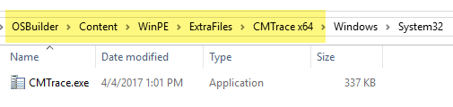
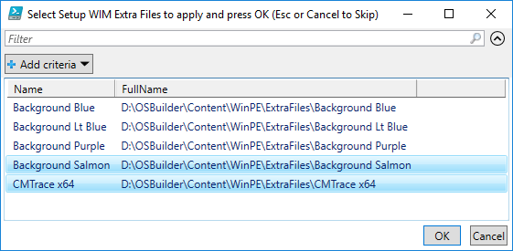
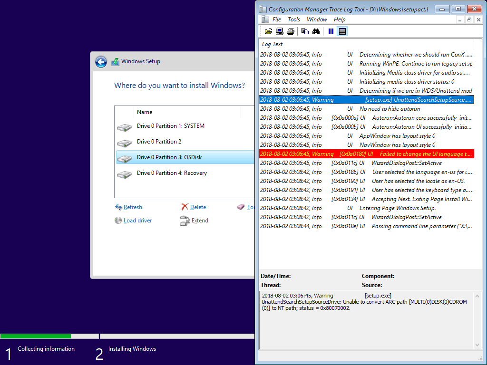

# WinPE Extra Files

You can now add Extra Files to WinPE.  Simply create a new directory in your OSDBuilder\Content\WinPE\ExtraFiles and add whatever you want in a relative path to the WinPE Root.  This means that if I want CMTrace.exe to go in WinPE under X:\Windows\System32, then my path would be \(change your Drive Letter as needed\):

```text
D:\OSDBuilder\Content\WinPE\ExtraFiles\CMTrace x64\Windows\System32
```



### New-OSBuildTask

When creating a new OSBuild Task, you will have the option to select multiple directories to be applied.  You will be prompted for each WinPE.  Once this is complete, simply create your OSBuild using Invoke-OSDBuilder and you are all set.



### CMTrace in Windows Setup

Its now a thing . . .



